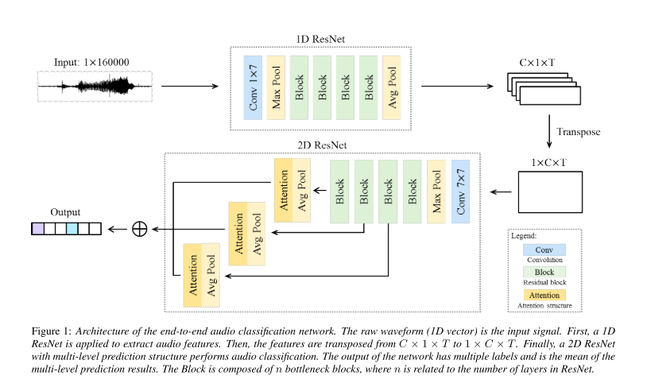
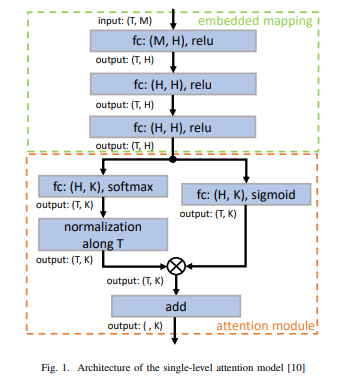
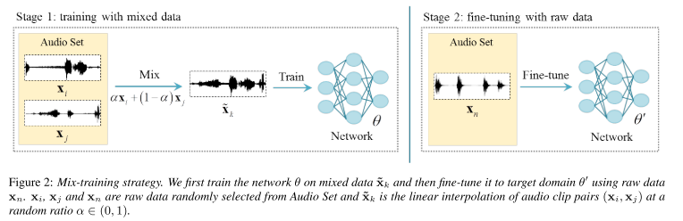
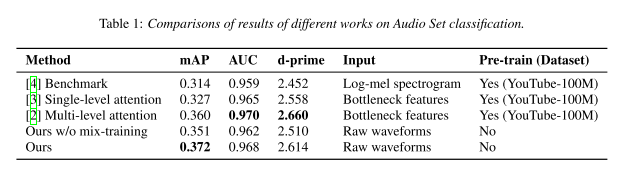
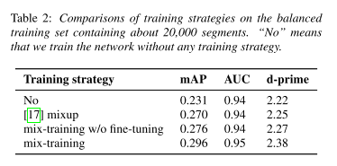

+++
# Date this page was created.
date = 2019-12-23
title = "An End-to-End Audio Classification System based on Raw Waveforms and Mix-Training Strategy"
summary = ""
external_link = "http://arxiv.org/abs/1911.09349"
categories = ["Time Series"]
math = true
markup = "goldmark"
+++

## 1. どんなもの？
* 音の生波形から，eventのclassificationを行う
* raw waveformを1D CNNで周波数解析し，得られたTransformed Imageを2D CNNで識別
* training dataが少ない場合でも有効なMix-trainingを提案

## 2. 先行研究と比べてどこがすごい？
* Audio ClassificationはGoogleのBottleneck featureを使った識別，Handcrafted featureを使った識別がBaselineだった
* Bottleneckは情報のlostが，Handcraftedは抽出の困難さが問題
* end-to-endな周波数特徴の抽出，識別を可能に

## 3. 技術や手法の"キモ"はどこ？
* キモは，**周波数特徴を抽出する1D CNNとその特徴を識別する2D CNN**
### Raw-waveforms-based network

#### 1D CNN
* 1D CNNで時間方向にdownsamplingをかけることで，周波数特徴を抽出
* FFTをNNに任せてるイメージで，識別に適した周波数特徴を抽出してくれることを期待
* 最終的には，$C \times 1 \times T$ (channel, 1, time)のfeature mapをtransposeして，$1 \times C \times T$ (1, channel, time)の画像に

#### 2D CNN
* 得られた周波数特徴画像を2D Convolution
* 勾配消失を防ぐため，multi-resolutionalなfeature mapからpredictionを出力
* attentionつき（attentionは多分，以下の構造）

* Avg Poolは多分GAP．．．？

### Mix-training strategy

* training dataが少ない場合に有効なMix-training．pretraining的な扱い
* 2つの入力を$\alpha \in (0, 1)$でblend

$$
\tilde{x}_k = \alpha x_i + (1-\alpha) x_j
$$

* $\tilde{x}_k$に対応する教師ラベルは以下（$y_i$,$y_j$はmulti-hot label)

$$
\tilde{y}_k = sign(y_i + y_j)
$$

* loss関数は

$$
L=-\frac{1}{K} \sum_{k, n} \left(1-\tilde{y}_{k n}\right) \log \left(1-t_{k n}\right)+\tilde{y}_{k n} \log t_{k n}
$$

$$
\mathbf{t_k} = f_\theta (\tilde{x}_k) = \[ t_{k1}, t_{k2}, ..., t_{kN} \]
$$

* Mix-trainingが終わった後にはmixしないデータでfine-tuning

## 4. どうやって有効だと検証した？
* Audio SetでBaselineとの精度比較
* 精度的には負けてるが，pretrainingなしなのはgoodかも

* mix-trainingの有効性確認も
* mix-upよりも高精度

## 5. 議論はあるか？
* 周波数特徴画像にFFTのような説明性はあるか？
* mix-trainingの教師データの総和が1にならないが良いのか．．．
* stemのConv 1x7は妥当か？

## 6. 次に読むべき論文はある？
* Yu, C., Barsim, K. S., Kong, Q., & Yang, B. (2018). Multi-level Attention Model for Weakly Supervised Audio Classification. Retrieved from http://arxiv.org/abs/1803.02353
* Zhang, H., Cisse, M., Dauphin, Y. N., & Lopez-Paz, D. (2017). mixup: Beyond Empirical Risk Minimization. Retrieved from https://arxiv.org/abs/1710.09412