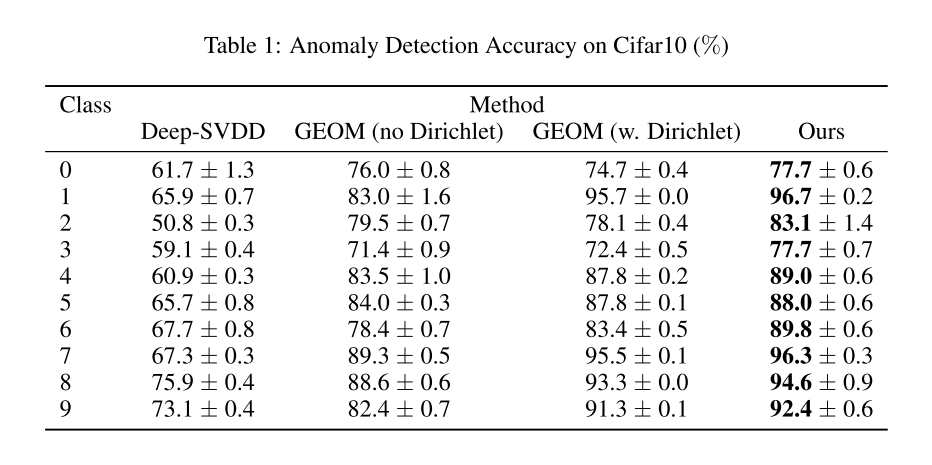
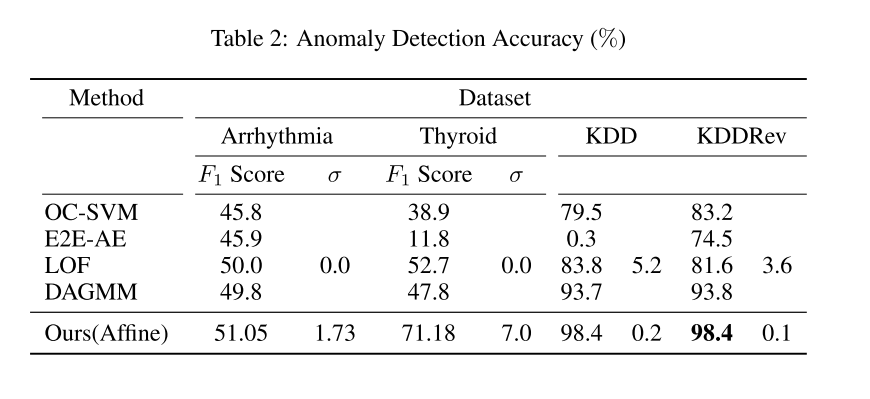

+++
# Date this page was created.
date = 2020-01-27
title = "Classification-Based Anomaly Detection for General Data"
summary = ""
external_link = "https://openreview.net/forum?id=H1lK_lBtvS"
categories = ["Anomaly Detection", "Self-supervised Learning"]
rate = 4
math = true
markup = "goldmark"
+++

## 1. どんなもの？
* Classification-BasedなSelf-supervised learningモデルを使った異常検知手法
* 幾何変換モデルを発展させた

## 2. 先行研究と比べてどこがすごい？
* ベースはGeometric-transformation classification(GEOM)
* ↓2点の解決
    * GEOMでは，Anomalyに対しても正常度が高くなってしまうことがあった
    * GEOMでは，画像しか対応できず1次元データに対しては適用不可だった

## 3. 技術や手法の"キモ"はどこ？
* GEOMのSoftmax + Categorical Cross Entoropyをcenter vectorをanchorとしたtripletに
* 幾何変換ではなく，アフィン変換（幾何ではなく，$Wx+b$）に

### GEOM
* GEOMでは画像$x \in X$を幾何変換$m \in M$で変換することで$T(x, m)$を生成
* $T(x, m)$を入力，$m$を教師ラベルとすることで幾何変換判別モデルを学習していた (Self-supervised)
* 正常データならこの変換の判別がうまくできるし，正常データでないなら判別がうまくできないという仮定を利用して異常検知
* 尤度としては
$$
P\left(m^{\prime} | T(x, m)\right)=\frac{P\left(T(x, m) \in X_{m^{\prime}}\right) P\left(m^{\prime}\right)}{\sum_{\tilde{m}} P\left(T(x, m) \in X_{\tilde{m}}\right) P(\tilde{m})}=\frac{P\left(T(x, m) \in X_{m^{\prime}}\right)}{\sum_{\tilde{m}} P\left(T(x, m) \in X_{\tilde{m}}\right)}
$$

* 問題点
    * 正常データに対して高い尤度を持つことは確認できるけど，異常データに対して低い尤度を持つとは言い難い
    * Outlier Exposureみたいに異常も教えてあげればいいけど，異常データを実際に学習に使えない場合は多い

### triplet lossの導入
* ↑の問題解決のために，判別モデルではなくmetric learning（距離学習系）の採用
* $T(x, m)$から特徴ベクトルを抽出するモデル$f$を学習
* lossにはtriplet lossを採用．anchorはそれぞれの幾何変換$m$の特徴ベクトルのcenter vector $c_m$，$s$はmargin
$$
c_m = \frac{1}{N}\Sigma_{x \in X}f(T(x, m))
$$

$$
L=\sum_{i} \max \left(\left\|f\left(T\left(x_{i}, m\right)\right)-c_{m}\right\|^{2}+s-\min _{m^{\prime} \neq m}\left\|f\left(T\left(x_{i}, m\right)\right)-c_{m^{\prime}}\right\|^{2}, 0\right)
$$

* 正常度は
$$
\tilde{P}\left(m^{\prime} | T(x, m)\right)=\frac{e^{-\left\|f(T(x, m))-c_{m^{\prime}}\right\|^{2}+\epsilon}}{\sum_{\tilde{m}} e^{-\left\|f(T(x, m))-c_{\tilde{m}}\right\|^{2}+M \cdot \epsilon}}
$$

$$
\text {Score}(x)=-\log P(x \in X)=-\sum_{m} \log \tilde{P}\left(T(x, m) \in X_{m}\right)=-\sum_{m} \log \tilde{P}(m | T(x, m))
$$

### transformation
* 幾何変換は画像データにしか適用できない場合がある
* Affine transformの適用．$W_m$, $b_m$はrandom matrix, vector
$$
T(x,m) = W_m x + b_m
$$
* 幾何変換は↑の特殊な形といえる．つまり一般化した形
* 無制限のvariationの獲得
* adversarial examplesから守ることができる

## 4. どうやって有効だと検証した？
* Cifar10で実験
 * transformの数は8

* 1次元データでも実験

## 5. 議論はあるか？
* Dirichlet weightingとは？
* ICLR2020 accept

## 6. 次に読むべき論文はある？
1. Izhak Golan and Ran El-Yaniv. Deep anomaly detection using geometric transformations. In NeurIPS, 2018
2. Dan Hendrycks, Mantas Mazeika, and Thomas G Dietterich. Deep anomaly detection with outlier exposure. arXiv preprint arXiv:1812.04606, 2018