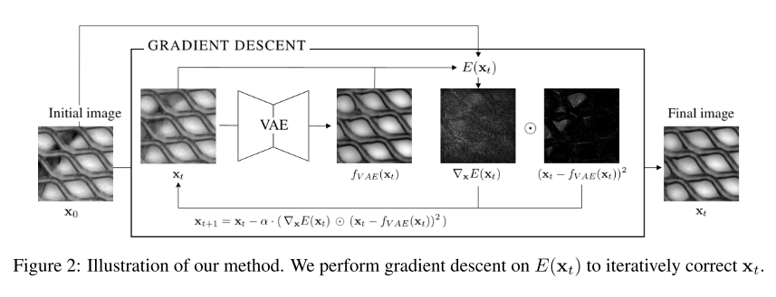
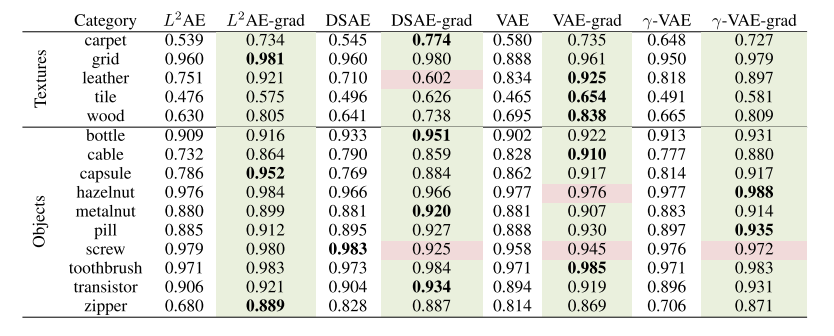
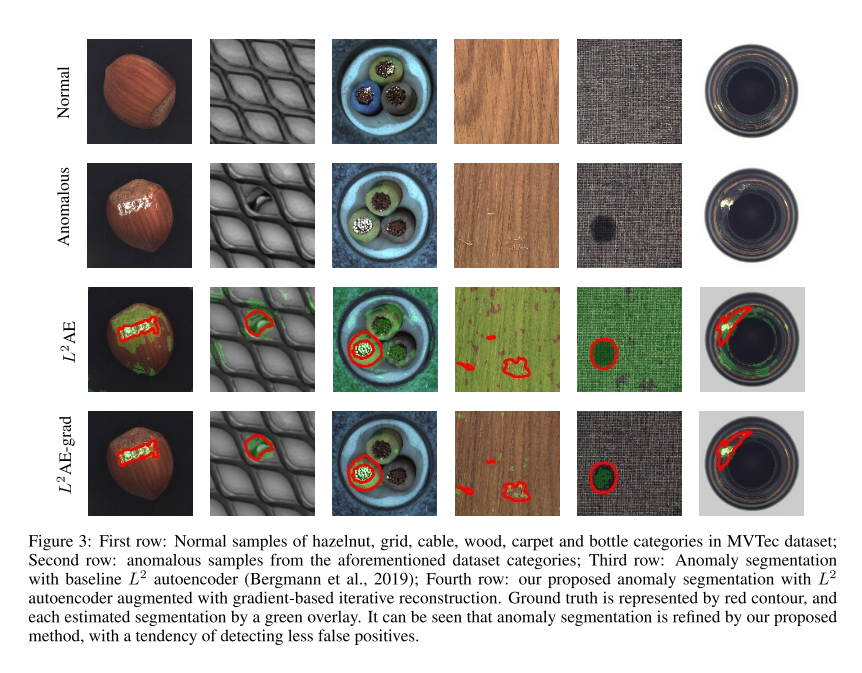

+++
# Date this page was created.
date = 2019-12-09
title = "Iterative energy-based projection on a normal data manifold for anomaly localization"
summary = ""
external_link = "https://openreview.net/forum?id=HJx81ySKwr"
categories = ["Anomaly Detection", "VAE"]
math = true
markup = "goldmark"
+++

## 1. どんなもの？
Autoencoderベースの異常検知手法．Autoencoderの問題である画像内の一部の異常が画像全体の復元に影響を与えてしまい上手く異常部位をLocalicationできないという問題にタックル．

## 2. 先行研究と比べてどこがすごい？
* Autoencoderベースのモデルでは，異常画像が入力された際に異常部位以外も再構成が崩れてしまい上手くLocalizationできないという問題があった
* また，Blurが発生してしまう
* 上記2点を繰り返し，$x$を更新していく方法で解決する

## 3. 技術や手法の"キモ"はどこ？

* エネルギー関数は，再構成誤差($L_r$)と正則化項（更新しても原画像から離れすぎないようにする正則化）
$$
E(x_t) = L_r(x_t) + \lambda|| x_t - x_0 ||
$$
$$
L_r(x_t) = \mathbb{E} \[ | f_{VAE}(x_t) - x_t | ^r \]
$$
* エネルギー関数を最小化するように，入力画像$x_0$を更新していく
$$
x_{t+1} = x_t - \alpha \nabla_x E(x_t)
$$
* 再構成が大きい部位は更新量を大きく，小さい部位は小さくすればなお良し
$$
x_{x+1} = x_t - \alpha ( \nabla_xE(x_t) \odot | f_{VAE}(x_t) - x_t | ^2  )
$$

* つまるところ，学習済みのVAEを用意して，テストデータを繰り返し入力・更新して元のManifoldにより近づけるイメージ （近いモデルはAnoGAN）

## 4. どうやって有効だと検証した？
* MVTECに対して，実験
* それぞれ ***-gradが提案手法

* 通常のAutoencoderより，適切に異常部位のLocalizationができていることを確認

## 5. 議論はあるか？
* iterativeにすることで推論時間はどのくらいになる？
* AnoGANと似たようなmethodだが，比較は？

## 6. 次に読むべき論文はある？
* Bin Dai and David P. Wipf. Diagnosing and enhancing VAE models. CoRR, abs/1903.05789, 2019. Ian