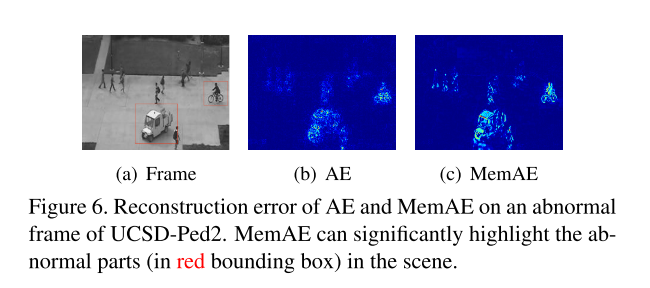

+++
# Date this page was created.
date = 2019-12-10
title = "Memorizing Normality to Detect Anomaly: Memory-augmented Deep Autoencoder for Unsupervised Anomaly Detection"
summary = ""
external_link = "http://arxiv.org/abs/1904.02639"
categories = ["Anomaly Detection"]
math = true
markup = "goldmark"
+++

## 1. どんなもの？
* Autoencoder（差分ベース）の異常検知モデル
* 潜在変数にMemory構造を導入することで正常データ以外も復元できてしまう”汎化”を防ぐ

## 2. 先行研究と比べてどこがすごい？
* Autoencoderを使った異常検知では，モデルが汎化してしまい異常データまでも復元できてしまう問題があった
* 潜在変数にMemory構造を追加することで，正常データの分布内のデータしか復元できないようにした

## 3. 技術や手法の"キモ"はどこ？
* **Memory構造がキモ**

### 全体の流れ

* Encoderからまず$z$を得る
$$
z = f_e(x; \theta_e)
$$
* メモリ構造を用いて$\hat{z}$を得る（後述）
* Decoderで$\hat{z}$から復元する

$$
\hat{x} = f_d(\hat{z}; \theta_d)
$$

### Memory
* それぞれ変数を定義する
    * $M \in \mathbb{R}^{N \times C}$:  Memory行列
    * $m_i$:    $M$の$i$行目Vector
    * $N$:  メモリ数
    * $C$:  $\hat{z}$の次元数（論文内では$z$の次元数と一致）
    * $w \in \mathbb{R}^{1 \times N} $: Attention Weight Vector

* Encoderから得られた$z$と$m_i$の距離（内積）を算出して，softmaxすることで$w$を求める
$$
w_i = \frac{\exp(d(z, m_i))}{\Sigma^N_{j=1}\exp(d(z, m_j))}
$$

$$
d(z, m_i) = \frac{zm_i^T}{|z||m_i|}
$$

* $\hat{z}$を求める
$$
\hat{z} = wM = \Sigma^N_{i=1}w_im_i
$$

#### Hard Shrinkage for Sparse Addressing
上述のMemory構造でも復元できてしまう異常サンプルは出てくるので，$w$をスパースにすることでより制限する

\\[
    \hat{w}_i = 
    \begin{cases}
      w_i  & \text{ if } w_i > \lambda  \\\\ 0 & \text{ otherwise }
    \end{cases}
\\]

### Objective
再構成誤差と$\hat{w}$そスパースにするための誤差の重み付き和
$$
L(\theta_e, \theta_d, M) = \frac{1}{T} \Sigma^T_{t=1}\[R(x^t, \hat{x}^t) + \alpha E(\hat{w}^t)\]
$$

$$
R(x^t, \hat{x}^t) = |x^t - \hat{x}^t| ^2
$$

$$
E(\hat{w}^t) = \Sigma^T_{i=1}-\hat{w}^t\log{\hat{w}^t}
$$

論文内では,$\alpha = 0.0002$

## 4. どうやって有効だと検証した？
画像では，MNIST・Cifar10で実験

動画では，UCSD-Ped2・CUHK・ShanghaiTechで実験

## 5. 議論はあるか？
* 汎化にスポット当てた論文でgood
* MVTec で実験してみたい

## 6. 次に読むべき論文はある？
