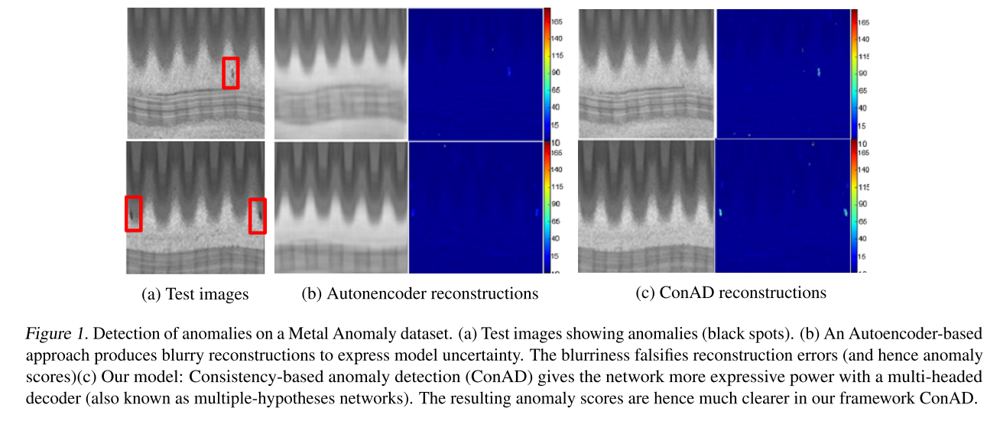
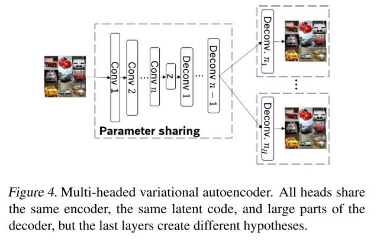
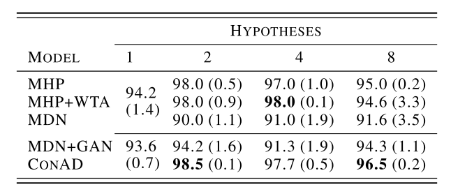

+++
# Date this page was created.
date = 2019-11-01
title = "Anomaly Detection With Multiple-Hypotheses Predictions"
summary = ""
external_link = "http://arxiv.org/abs/1810.13292"
math = true
markup = "mmark"
+++

## 1. どんなもの？
異常検知の論文．Autoencoderの出力を複数にすることでAutoencoderの異常検知の問題を解決する．

## 2. 先行研究と比べてどこがすごい？
* Autoencoderの入出力による異常検知では，出力がぼやけてしまい高周波成分が再構成できず正常と異常のSN比が小さいという問題があった．
* 後述するMultiple-Hypothesesにより高周波成分の再構成に成功．

## 3. 技術や手法の"キモ"はどこ？
### Multiple-Hypotheses
VAEのDecoderから得られる出力を複数にする．
具体的には，$H$個のDeconv Layerを最終層に配置し，それぞれ独立のパラメータで出力させる（事後分布はGaussian）．

### winner-takes-all (WTA) loss
複数のDecoderの出力に対して，全ておいて再構成誤差をBack Propagationするのではなく，
最も再構成誤差が低い出力(winner)のみから再構成誤差をBack Propagationさせる．

$$
\begin{aligned}
L_{W T A}\left(x_{i} | \theta_{h}\right) &=E_{z_{k} \sim q_{\phi}(z | x)}\left[\log p_{\theta_{h}}\left(x_{i} | z_{k}\right)\right] \\ \text { s.t. } h &=\arg \max _{j} E_{z_{k} \sim q_{\phi}(z | x)}\left[\log p_{\theta_{j}}\left(x_{i} | z_{k}\right)\right]
\end{aligned}
$$

### Discriminator
WTA Lossでは再構成誤差をBack Propagationする出力以外については更新がされないことになってしまう．
そのため，それ以外の出力についても入力の分布に近づけるようにDiscriminatorを用意する．
realはもちろん入力画像で，fakeはVAEの出力（Bestとそれ以外）とランダムサンプリングされた$z$からDecoderを介して得られた出力である．

$$
\begin{aligned}
\min _{D} \max _{G} L_{D}(x, z)=&\min _{D} \max _{G} \underbrace{-\log \left(p_{D}\left(x_{r e a l}\right)\right)}_{L_{real}} +L_{f a k e}(x, z)
\end{aligned}
$$

$$
\begin{array}{l}{L_{\text {fake }}(x, z)=\log \left(p_{D}\left(\hat{x}_{z \sim \mathcal{N}(0,1)}\right)\right)}  {+\log \left(p_{D}\left(\hat{x}_{z \sim \mathcal{N}}\left(\mu_{\left.z | x, \Sigma_{z | x}\right)}\right)\right)+\log \left(p_{D}\left(\hat{x}_{\text {best-guess }}\right)\right)\right.}\end{array}
$$

VAEのLoss関数は，

$$
\min _{G} L_{G}=\min _{G} L_{W T A}+K L\left(q_{\phi}(z | x) \| \mathcal{N}(0,1)\right)-L_{D}
$$

### 異常度の算出
WTA Lossを異常度とする．
Sumしなければ，異常箇所のLocalizationに使えるのは従来のAutoencoder通り．

## 4. どうやって有効だと検証した？
CIFAR10(1vs9)とMETAL ANOMALY（論文内にはリンクなし）で実験．
CIFAR10でAUROC: 67.1．
METAL ANOMALYでは異常度が大きいPixelの上位10%のSumを全体の異常度として算出．

## 5. 議論はあるか？
* Blurが解消されたのは，VAE-GAN構造にしたことによるところが大きいと思うが果たして．
* 高周波成分が再構成されることにより，今まで差分として出てこなかった部分もあると思う．

## 6. 次に読むべき論文はある？
