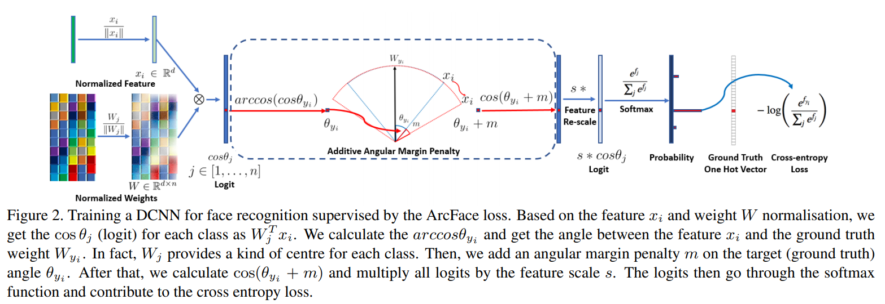
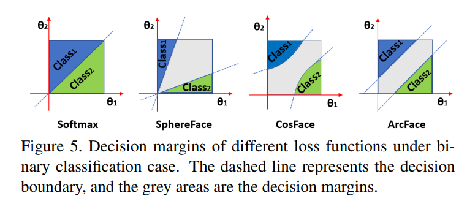
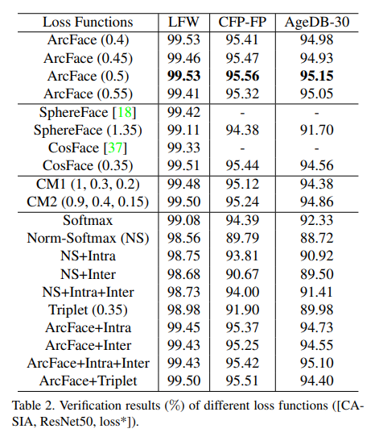

+++
# Date this page was created.
date = 2019-11-17
title = "ArcFace: Additive Angular Margin Loss for Deep Face Recognition"
summary = ""
external_link = "https://arxiv.org/abs/1801.07698"
math = true
markup = "mmark"
+++

## 1. どんなもの？
Metric Learningの論文．分類をして，各クラス内の分散を小さく，クラス間の分散を大きくする系のMetric Learining．

## 2. 先行研究と比べてどこがすごい？
* クラス分類モデルのSoftmaxを少し改良するだけで適用できる
* ArcFaceと先行研究のSpehereFace・CosFaseのLoss関数は似ていて，それを一般化している

## 3. 技術や手法の"キモ"はどこ？
### Architecture

全体的な流れとしては，
Base Block（VGGとかResNetとか）から特徴ベクトルを出力

$$
x' = f(x)
$$

出力された特徴ベクトルをL2正則化

$$
x'' = \frac{x'}{|x'|^2}
$$

全結合層の重みをL2正則化

$$
w' = \frac{w}{|w|^2}
$$

正則化された特徴ベクトルと重みを内積（これがcosの値）

$$
cos\theta = x'' \cdot w'
$$

これにAdditive Angular Margin Penaltyを適用する．

### Additive Angular Margin Penalty
Additive Angular Margin Penaltyは正解ラベルに対応する出力の値に対して，Marginを加えることで，クラス内分散を小さくするような学習を行う．
イメージとしては，正解ラベルにのみ厳しい罰則を与えてよりDiscriminativeにする感じ．

正解クラス$$j$$の出力に対して，Marginを加算する

$$
\theta_j' = \{
\begin{array}{ll}
arccos(cos\theta_i) + m & i=j \\
arccos(cos\theta_i) & otherwise
\end{array}
$$

各要素を定数倍する（温度パラメータ）

$$
logit = s cos(\theta_j')
$$

softmax関数にかける

$$
y = softmax(logit)
$$

この一連の流れを組み込んだLoss関数は

$$
L_{3}=-\frac{1}{N} \sum_{i=1}^{N} \log \frac{e^{s\left(\cos \left(\theta_{y_{i}}+m\right)\right)}}{e^{s\left(\cos \left(\theta_{y_{i}}+m\right)\right)}+\sum_{j=1, j \neq y_{i}}^{n} e^{s \cos \theta_{j}}}
$$

### ArcFace・SpehereFace・CosFase の一般化
$m_1$がSpehereFace，$m_2$がArcFace，$m_3$がCosFace．

$$
L_{4}=-\frac{1}{N} \sum_{i=1}^{N} \log \frac{e^{s\left(\cos \left(m_{1} \theta_{y_{i}}+m_{2}\right)-m_{3}\right)}}{e^{s\left(\cos \left(m_{1} \theta_{y_{i}}+m_{2}\right)-m_{3}\right)}+\sum_{j=1, j \neq y_{i}}^{n} e^{s \cos \theta_{j}}}
$$

それぞれの識別境界の違いは下図になるらしい．

## 4. どうやって有効だと検証した？
顔認識データセットであるLFW，CFP-FP，AgeDB30で実験．
比較手法がどれも精度が優秀なので，あまり有効さはわからない．

## 5. 議論はあるか？
* Out of dataset のサンプルが来た時にどれくらい精度がでるか？

## 6. 次に読むべき論文はある？
* CosFace: Large Margin Cosine Loss for Deep Face Recognition https://arxiv.org/abs/1801.09414
* SphereFace: Deep Hypersphere Embedding for Face Recognition https://arxiv.org/abs/1704.08063
