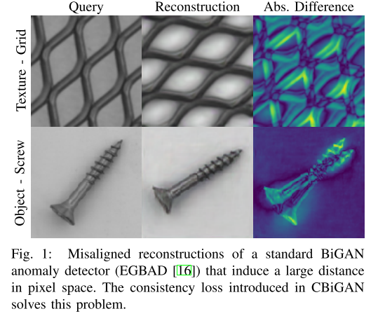

+++
# Date this page was created.
date = 2020-11-30
title = "Combining GANs and AutoEncoders for Efficient Anomaly Detection"
summary = ""
external_link = "http://arxiv.org/abs/2011.08102"
categories = ["Anomaly Detection"]
tags = []
rate = 4
math = true
markup = "goldmark"
+++

## 1. どんなもの？
* Anomaly Detectionの枠組み
* EGBAD(Efficient GAN Based Anomaly Detection)の改良版

## 2. 先行研究と比べてどこがすごい？
* EGBADでは$x$と$G(E(x))$に一貫性がなく，入出力の誤差が大きくなることがあった

## 3. 技術や手法の"キモ"はどこ？
### Loss
* BiGANの$x$と$G(E(x))$に一貫性を強制するLossを導入
$$
\mathcal{L} _ {R}(\mathbf{x})=\|\mathbf{x}-G(E(\mathbf{x}))\|_{1}
$$

$$
\mathcal{L} _ {R^{\prime}}(\mathbf{z})=\|\mathbf{z}-E(G(\mathbf{z}))\|_{1}
$$

$$
\mathcal{L} _ {C} (\mathbf{x}, \mathbf{z}) = \mathcal{L} _ {R}(\mathbf{x}) + \mathcal{L} _ {R^{\prime}}(\mathbf{z})
$$
* GANのmetricにはWasserstein Distanceを使用

$$
\min _ {G, E} \max _ {D} \mathbb{E} _ {\mathbf{x} \sim p_{\text {data }}(\mathbf{x})}[D(\mathbf{x}, E(\mathbf{x}))]-\mathbb{E}_{\mathbf{z} \sim p(\mathbf{z})}[D(G(\mathbf{z}), \mathbf{z}]
$$

* ↑2つを重み$\alpha$で足し合わせる
$$
\mathcal{L} _ {E, G}^{*}=(1-\alpha) \mathcal{L} _ {E, G}+\alpha \mathcal{L}_{C}
$$

### Anomaly Score
$$
A(\mathbf{x})=(1-\lambda) \mathcal{L} _ {R}(\mathbf{x})+\lambda \mathcal{L} _ {f_{D}}(\mathbf{x})
$$

$$
\mathcal{L} _ {f _ {D}}(\mathbf{x})=\left\|f_{D}(\mathbf{x}, E(\mathbf{x}))-f_{D}(G(E(\mathbf{x})), E(\mathbf{x}))\right\|_{1}
$$

## 4. どうやって有効だと検証した？
* MVTEC ADで実験

* EGBADとの比較

## 5. 議論はあるか？
* 意外と今までconsistencyを導入したものはなかった？
* 評価指標はこれで正しい？面積の大きい欠陥しか検出できない気がする
* 公式実装あり [github](https://github.com/fabiocarrara/cbigan-ad/)

## 6. 次に読むべき論文はある？