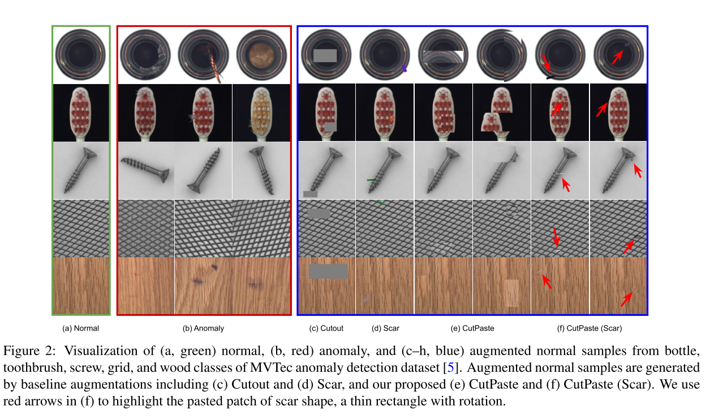
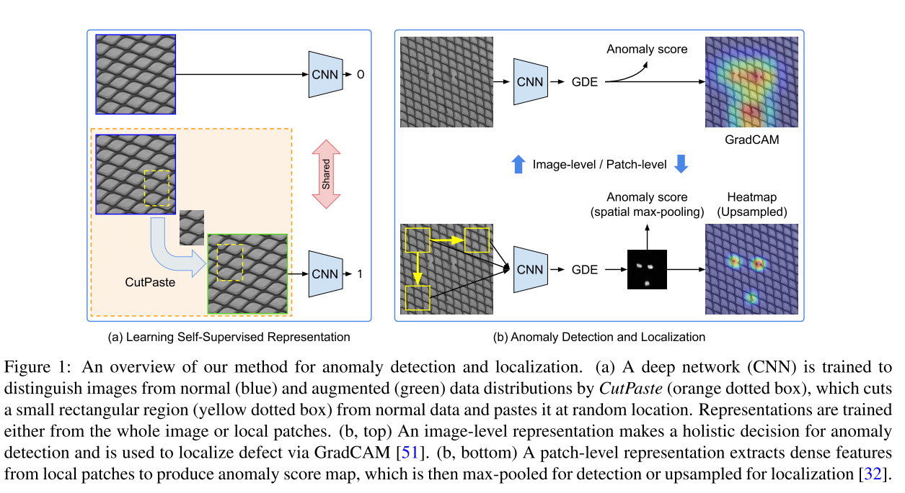
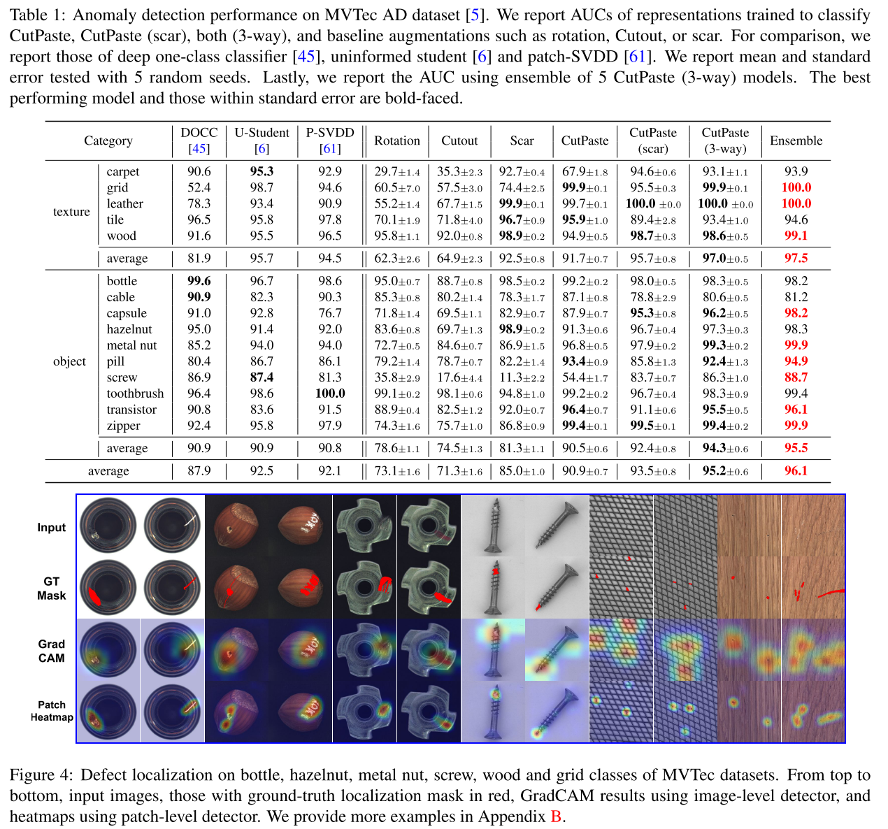

+++
# Date this page was created.
date = 2021-05-03
title = "CutPaste: Self-Supervised Learning for Anomaly Detection and Localization"
external_link = "https://arxiv.org/abs/2104.04015"
categories = ["Anomaly Detection"]
tags = ["CVPR2021"]
rate = 5
math = true
markup = "goldmark"
summary = "Cutoutを異常検知に適応させたCutpasteを提案．SSL型のADで初めてMVTecで高精度．画像の一部を切り貼りして疑似不良を生成し，識別器を学習するのみという非常に単純な枠組みながらPaDiMに迫る精度．"
+++

## 1. どんなもの？
* SSL型の異常検知
* Cutoutを異常検知・外観検査に適応させたような形

## 2. 先行研究と比べてどこがすごい？
* SSL型のAD手法は，大域的異常にしか対応できなかった
  * cifar10とかには強かったが，MVTecには弱い
  * 要は外観検査向きではない
* 自然画像認識のデータセット拡張手法であるCutoutをベースに局所的異常に対応可能な形に

## 3. 技術や手法の"キモ"はどこ？
### 学習
* 画像内からランダムな大きさ・角度のパッチを切り出して，画像内にランダムに張り付けることで異常データを生成
  * 特に細長い矩形をscarと呼ぶ
  * 学習時にはscarと通常の矩形の両方を使う
* Cutpasteしてない画像を正常，Cutpasteした画像を異常として識別器を学習

$$
\mathcal{L} = \mathbb{E}_{x \sim \mathcal{X}} \[ \text{BCE}(f(x), 0) + \text{BCE}(f(CP(x)), 1) \]
$$

### 推論
1. 全training dataに対して，NNの中間層の出力を得てその平均$\mu$と分散$\Sigma$を算出
2. Gaussian Density Estimator (GDE)を用いて，確率密度を算出して異常度とする

$$
\log{p_{gde}(x)} \propto \{ -\frac{1}{2} (f^*(x) - \mu)^T \Sigma^{-1} (f^*(x) - \mu) \}
$$

3. 異常個所の可視化にはGrad-CAMを用いる

### Patch Base
* cutpaste適用前の画像に対して，random cropしたら可能（当たり前）
* 推論時には一定ストライドで推論を繰り返す

$$
\mathcal{L} = \mathbb{E}_{x \sim \mathcal{X}} \[ \text{BCE}(f(\text{crop}(x)), 0) + \text{BCE}(f(CP(\text{crop}(x)))), 1) \]
$$

### Pretrained model
* EfficentNetなどの学習済みモデルをcutpasteでfinetuneして，GDEで異常度を算出

## 4. どうやって有効だと検証した？
* MVTec で実験
  * 3-way: 正常，CP-scar，CPの3クラスで識別器を学習
  * Ensemble: 3-way のモデルを5個学習してEnsemble


  * pretrained modelの実験


## 5. 議論はあるか？
* 外観検査などでは局所的でも異常があれば不良だから検出する必要がある
  * そんな不良は良品に欠陥（打痕や汚れなど）をCutpasteした形
* SSL系で初めて，MVTecで高精度でADできた
  * 精度的にはPaDiMに劣る

## 6. 次に読むべき論文はある？
1. T. Devries and G. W. Taylor, “Improved Regularization of Convolutional Neural Networks with Cutout,” arXiv Prepr. arXiv1708.04552, 2017.