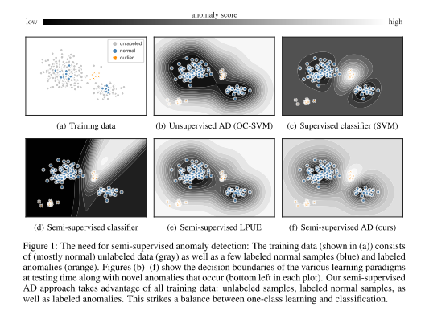
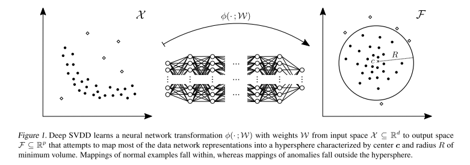
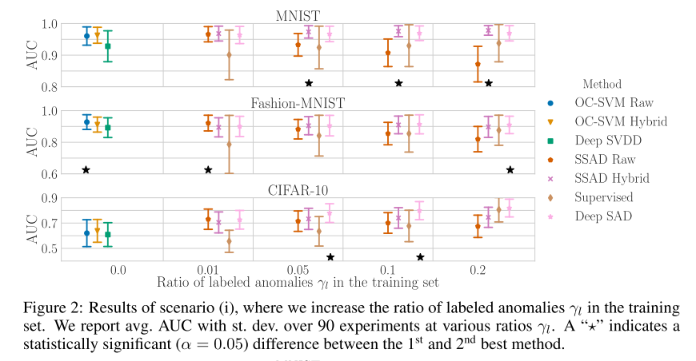
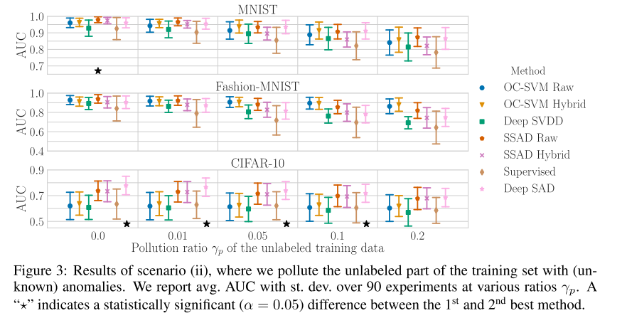

+++
# Date this page was created.
date = 2020-02-27
title = "Deep Semi-Supervised Anomaly Detection"
summary = ""
external_link = "https://openreview.net/forum?id=HkgH0TEYwH"
categories = ["Anomaly Detection"]
rate = 4
math = true
markup = "goldmark"
+++

## 1. どんなもの？
* 大量の正常データと少量の異常データからAnomaly Detectionを行う
* Deep SVDDベースのDeep SADを提案
    * Deep SVDD + 少量の教師つきデータ + mutual info

## 2. 先行研究と比べてどこがすごい？
* Deep SVDD (Unsupervised: 正常データのみ)にSemi-Supervised: 正常データ + 少量の教師つきデータ の枠組みを追加
* 最近この問題設定流行り？
    * より実利用に近い感じがしてgood
* classification と one-class learning のいいとこどり

## 3. 技術や手法の"キモ"はどこ？
* **Deep SVDD + 少量の教師つきデータ + mutual info** 

### Mutual Information
* Information Bottleneck (classification)では，入力$x$と潜在変数$z$，ラベル$y$それぞれのmutual info $\mathbb{I}$を最大化
$$
min_{p(z|x)} {\mathbb{I}(X; Z) - \alpha\mathbb{I}(Z; Y)}
$$
* Unsupervisedなら，正則化項$R$を使って
$$
max_{p(z|x)} {\mathbb{I}(X; Z) + \beta R(Z)}
$$
* autoencoderはInfomaxの枠組みとも考えられる

### Deep SVDD

* 以前まとめた https://salty-vanilla.github.io/portfolio/post/deep_svdd/ を参照
$$
\min _ {w} \frac{1}{n} \sum_{i=1}^{n}\left\|\phi\left(\boldsymbol{x} _ {i} ; \mathcal{W}\right)-\boldsymbol{c}\right\|^{2}+\frac{\lambda}{2} \sum_{\ell=1}^{L}\left\|\boldsymbol{W}^{\ell}\right\|_{F}^{2}, \quad \lambda>0
$$
* Deep SVDDはemprical varianceを最小化している
* $s(x) = \left\|\phi\left(\boldsymbol{x} _ {i} ; \mathcal{W}\right)-\boldsymbol{c}\right\|^{2} $ はlatent gaussian のentropyの上界とみなせて，それの最小化をしている
    * AutoencoderでNNを初期化していることが前提

### Deep SAD (Semi-supervised Anomaly Dection)
#### 変数の定義
* $x_1, \cdots, x_n$ : unlabeled samples
* $(\tilde{x_1}, \tilde{y_1}), \cdots, (\tilde{x_m}, \tilde{y_m})$ : labeled samples
    * normalなら $\tilde{y} = +1$
    * anomalyなら $\tilde{y} = -1$

### 目的関数
* Unsupervised のInfomaxを適用して
$$
max_{p(z|x)} {\mathbb{I}(X; Z) + \beta (\mathbb{H}(Z^{-}) - \mathbb{H}(Z^{+}))}
$$
    * $\mathbb{H}$ : entropy
    * $Z^{-}$ : $\tilde{y} = -1$ の$x$に対する潜在変数
    * $Z^{+}$ : $\tilde{y} = +1$ の$x$に対する潜在変数

* これにDeep SVDDの枠組みを適用すると
$$
\min _ {\boldsymbol{w}} \frac{1}{n+m} \sum_{i=1}^{n}\left\|\phi\left(\boldsymbol{x} _ {i} ; \mathcal{W}\right)-\boldsymbol{c}\right\|^{2}+\frac{\eta}{n+m} \sum_{j=1}^{m}\left(\left\|\phi\left(\tilde{\boldsymbol{x}} _ {j} ; \mathcal{W}\right)-\boldsymbol{c}\right\|^{2}\right)^{\tilde{y} _ {j}}+\frac{\lambda}{2} \sum_{\ell=1}^{L}\left\|\boldsymbol{W}^{\ell}\right\|_{F}^{2}
$$
    * 1, 3項目はDeepSVDD
    * 2項目が↑式の正則化項にあたる
        * normalなら$c$に近く
        * anomalyなら$c$から遠く

## 4. どうやって有効だと検証した？
* MNIST, Fashion-MNIST, Cifar10で実験
* labelつきデータの異常データを増やすほどAUC上昇

* labelなしデータの中に異常データが混入しても他手法よりも精度が落ちない

## 5. 議論はあるか？
* Deep SVDD + Semisupervisedは自分も考えていただけに先越された感
* 今年はこの問題設定流行りそう

## 6. 次に読むべき論文はある？
