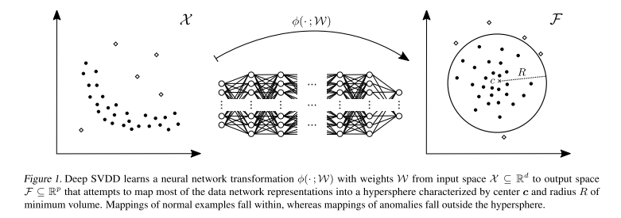

+++
# Date this page was created.
date = 2020-02-16
title = "Deep One-Class Classification"
summary = ""
external_link = "http://proceedings.mlr.press/v80/ruff18a.html"
categories = ["Anomaly Detection"]
rate = 5
math = true
markup = "goldmark"
+++

## 1. どんなもの？
* One-Class SVM (OCSVM)の非線形カーネルをNNで置き換えたモデル
* anomaly detectionの枠組みとして，soft-boundary と one-class Deep SVDDを提案

## 2. 先行研究と比べてどこがすごい？
* OCSVMの非線形カーネルをNNで置き換えた
    * OSCVMより優れた表現力を持つ
* SVDD (Support Vector Data Description)
* OCSVMのobjective
    * $x$ : sample
    * $w$ : weights
    * $\phi$ : kernel function
    * $\rho$ : distance from the origin to hyperplane $w$
    * $\xi$ : margin
$$
\min _ {\boldsymbol{w}, \rho, \boldsymbol{\xi}} \frac{1}{2}\|\boldsymbol{w}\|_{\mathcal{F}_{k}}^{2}-\rho+\frac{1}{\nu n} \sum_{i=1}^{n} \xi_{i}
$$
$$
\text { s.t. } \quad\left\langle\boldsymbol{w}, \phi_{k}\left(\boldsymbol{x} _ {i}\right)\right\rangle_{\mathcal{F} _ {k}} \geq \rho-\xi_{i}, \quad \xi_{i} \geq 0, \quad \forall i
$$
## 3. 技術や手法の"キモ"はどこ？
* **OCSVM** + **NN**

### soft boudary
* objective
$$
\min _ {R, W} R^{2}+\frac{1}{\nu n} \Sigma_{i=1}^n \max \( 0,  \\|\phi\(x_{i} ; \mathcal{W}\)-c\\|^{2}-R^{2}\) +\frac{\lambda}{2} \sum_{\ell=1}^{L}\left\|\boldsymbol{W}^{\ell}\right\|_{F}^{2}
$$
    * $R$はミニバッチ内の0.9 quantile目のdistance : $\\|\phi\(x_{i} ; \mathcal{W}\)-c\\|^{2}$
    * $R$より中心から離れたサンプルだけにペナルティを与える感じ

### one-class
* objective
$$
\min _ {w} \frac{1}{n} \sum_{i=1}^{n}\left\|\phi\left(\boldsymbol{x}_ {i} ; \mathcal{W}\right)-\boldsymbol{c}\right\|^{2}+\frac{\lambda}{2} \sum_{\ell=1}^{L}\left\|\boldsymbol{W}^{\ell}\right\|_{F}^{2}
$$

### 異常度の算出
$$
s(\boldsymbol{x})=\left\|\phi\left(\boldsymbol{x} ; \mathcal{W}^{*}\right)-\boldsymbol{c}\right\|^{2}
$$

### Properties
* weightを0初期化しない
    * $\boldsymbol{c}$は初期化したNNの出力の平均ベクトルとする
* biasを用いない
* bounded function （有界関数）を活性化関数に使わない
    * relu族を使おう
* $nu$はoutlierの割合の上限とする

## 4. どうやって有効だと検証した？
* Cifar10，MNISTで実験
* OCSVMに勝るのはもちろん，DCAEやAnoGANより高精度

* 同クラス内でもnormal / anomalousなsampleが検出できている

## 5. 議論はあるか？
* MNISTやCifarはNovelty Detectionの成分が強い気がする
    * 外観検査とかで使えるかは検証しないとわからん
    * 傷があるとか局所的に異常とか
* ミニバッチの大きさはどのくらい精度に影響する？

## 6. 次に読むべき論文はある？
1. Chalapathy, R., Menon, A. K., & Chawla, S. (2018). Anomaly Detection using One-Class Neural Networks. Retrieved from http://arxiv.org/abs/1802.06360
