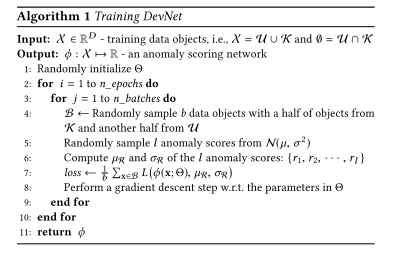

+++
# Date this page was created.
date = 2020-02-16
title = "Deep Anomaly Detection with Deviation Networks"
summary = ""
external_link = "https://arxiv.org/abs/1911.08623"
categories = ["Anomaly Detection"]
rate = 4
math = true
markup = "goldmark"
+++

## 1. どんなもの？
* 大量の正常データと少量の異常データからAnomaly Detectionを行う
* 枠組みとしてはDeep SVDDに近い

## 2. 先行研究と比べてどこがすごい？
* 正常データからAnomaly Detectionモデルを作れるのは当たり前
* 実利用においては，少量の異常データを如何にうまく使うかが求められる
* end2end
    * AnoGANなどはnot end2end

## 3. 技術や手法の"キモ"はどこ？
* 大量の正常データと**少量の異常データ**からAnomaly Detectionを行う

### 変数の定義
* $ \mathcal{X} = \\{ x_1, x_2, \cdots, x_N, x_{N+1}, \cdots, x_{N+K} \\} $ : training samples
* $\mathcal{U} = \\{ x_1, x_2, \cdots, x_N \\}$ : unlabeled samples (正常データとごく少量の異常データ)
* $\mathcal{K} = \\{ x_{N+1}, x_{N+2}, \cdots, x_{N+K} \\}$ : labeled samples (少量の異常データ)
* $K << N$ : 異常データは少量
* $\phi(x, \theta)$ : Scoring Network

### Framework
1. Scoring NetworkからScoreを算出
2. Reference Scoreを算出
    * 確率分布$F$から$l$個の乱数を生成
    * $l$個の乱数から平均$\mu_R$と分散$\sigma_R$を算出
    * なにかNNとかあるわけではないので注意
    * $F$は$\mathcal{N}(\mu=0, \sigma=1)$，$l=5000$くらいで十分らしい

3. Deviation Lossを算出
    * $x \sim \mathcal{U}$ なら $y=0$ (正常) deviationを$0$に
    * $x \sim \mathcal{K}$ なら $y=1$ (異常) deviationを$a$に
$$
\operatorname{dev}(\mathbf{x})=\frac{\phi(\mathbf{x} ; \Theta)-\mu_{\Re}}{\sigma_{\mathcal{R}}}
$$
$$
L\left(\phi(\mathbf{x} ; \Theta), \mu_{\mathcal{R}}, \sigma_{\mathcal{R}}\right)=(1-y)|dev(\mathbf{x})|+y \max (0, a-\operatorname{dev}(\mathbf{x}))
$$

## 4. どうやって有効だと検証した？
* 様々なAD datasetでSoTA
    * REPEN: limited labeld dataのAD
    * Deep SVDD: AD．タスクに合わせてenhanceしたモデルを実装したとのこと
    * prototypical networks (FSNet) : few-shot classification
    * iForest: AD

## 5. 議論はあるか？
* $F$が標準正規分布なら，$\mu_R=0$，$\sigma=0$となってデータに全く依存しないReference Scoreになってるけどいいのか？
    * この筆者の次の論文では解決されるらしい[1]
* 結局ミニバッチのサンプリングを$\mathcal{U}$から半分，$\mathcal{K}$から半分とってきてるのが大きそう

## 6. 次に読むべき論文はある？
1. Pang, G., Shen, C., Jin, H., & Hengel, A. van den. (2019). Deep Weakly-supervised Anomaly Detection. Retrieved from https://arxiv.org/abs/1910.13601
