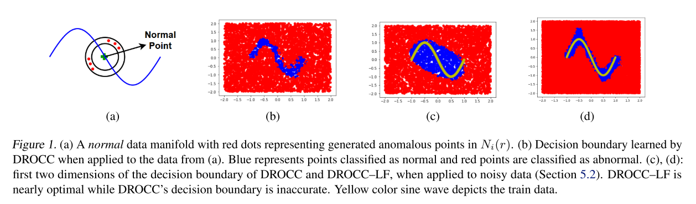
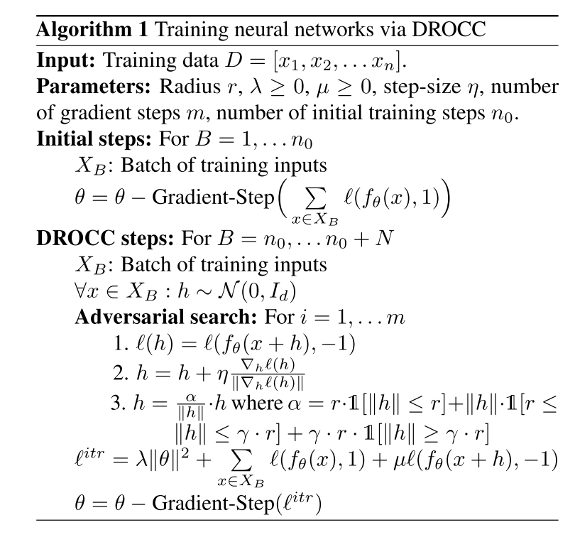
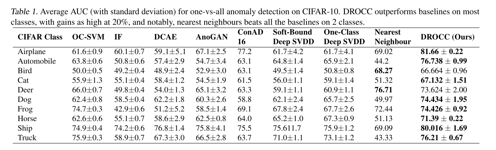
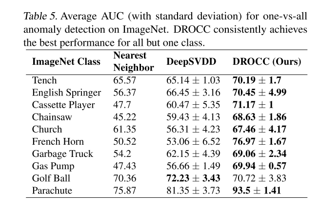
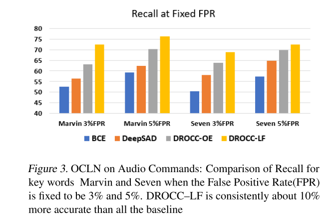

+++
# Date this page was created.
date = 2020-11-23
title = "DROCC: Deep Robust One-Class Classification"
summary = ""
external_link = "https://www.microsoft.com/en-us/research/publication/drocc-deep-robust-one-class-classification/"
categories = ["Anomaly Detection"]
tags = ["ICLR2020"]
rate = 4
math = true
markup = "goldmark"
+++

## 1. どんなもの？
* One Class Learningの枠組み
* side-informationを必要とせず，representation collapseに対してrobust
* negative examples を用いたDROCC-LN(Limeted Negatives)も提案

## 2. 先行研究と比べてどこがすごい？
* GEOM系は画像などのtransformに対して事前知識が必要（汎用性もない）
* DeepSVDDは全てが同じ特徴に落ちてしまうrepresentation collapseが問題

## 3. 技術や手法の"キモ"はどこ？
仮定：
> The set of typical points $S$ lies on a low dimensional locally linear manifold that is well-sampled. In other words, outside a small radius around a training (typical) point, most points are anomalous.

> 正常 $S$ は低次元な局所的線形多様体上に存在し，よくsamplingされている．言い換えるとtrainingデータの周りの小さな半径の外側が異常である．

### DROCC
* 入力データをNNで次元を落として正常ベクトル$f_\theta(x)$とその外側ベクトル$f_\theta(\tilde{x})$を生成
* $f_\theta(\tilde{x})$を生成するのに敵対的枠組みを利用
* $l$はcrossentropyとして正常1・外側0として分類タスクに持っていく

$$
\ell^{\mathrm{dr}}(\theta)=\lambda\|\theta\|^{2}+\sum_{i=1}^{n}\left[\ell\left(f_{\theta}\left(x_{i}\right), 1\right)+\mu \max _ {\tilde{x} _ {i} \in} \ell\left(f_{\theta}\left(\tilde{x}_{i}\right),-1\right)\right]
$$

$$
N_{i}(r) \stackrel{\text { def }}{=}  \\{ \| \tilde{x_i} - x_i \|_2  \leq \gamma \cdot r; r \leq | \tilde{x_i} - x_i \|, \forall j=1,2, \ldots n\\} 
$$

### DROCC-LN
* DROCCにラベルを付与（Outlier Exposureの枠組み）
* 距離を測るときに↑のようにユークリッドではなくマハラノビスで $\| \tilde{x_i} - x_i \| _ \Sigma$

$$
\ell^{\mathrm{lf}}(\theta)=\lambda\|\theta\|^{2}+\sum_{i=1}^{n}\left[\ell\left(f_{\theta}\left(x_{i}\right), y_i\right)+\mu \max _ {\tilde{x} _ {i} \in} \ell\left(f_{\theta}\left(\tilde{x}_{i}\right),-1\right)\right]
$$

$$
N_{i}(r) \coloneqq \\{ \tilde{x_i}, r \leq \| \tilde{x_i} - x_i \| _ \Sigma \leq \gamma \ldots r \\}
$$

## 4. どうやって有効だと検証した？
* Cifar10で実験

* Imagenetで実験

* 音声データを使ってDeepSADと比較

## 5. 議論はあるか？
* 正常の外側をselfで作るself-supervisedの枠組みといっていい？
* MVTec ADでの実験が欲しかった
* 公式実装あり [github](https://github.com/Microsoft/EdgeML)

## 6. 次に読むべき論文はある？