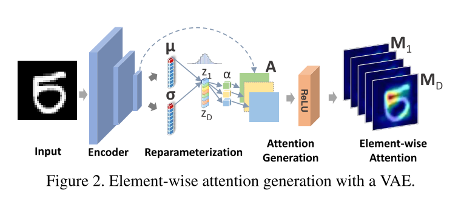
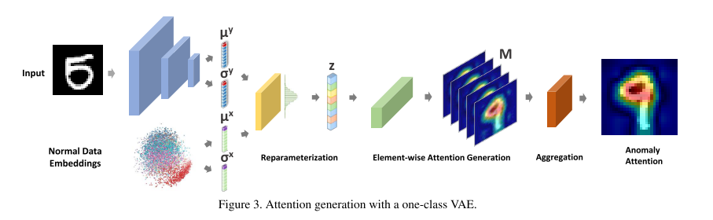
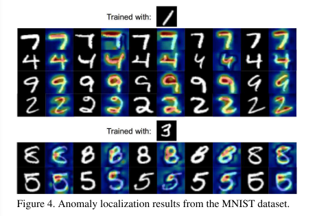
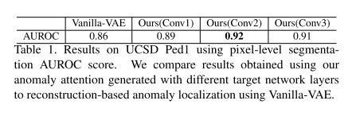
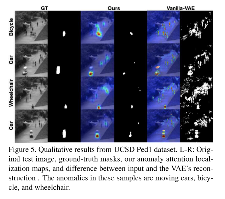
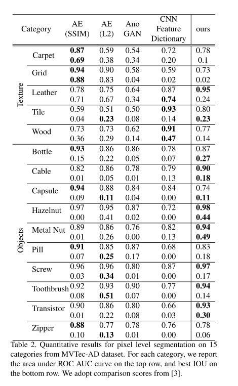
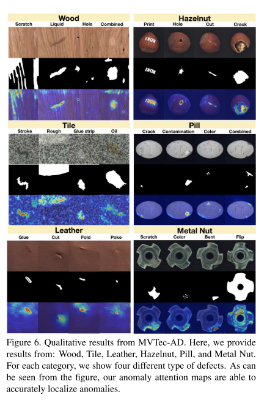

+++
# Date this page was created.
date = 2020-08-10
title = "Towards Visually Explaining Variational Autoencoders"
summary = ""
external_link = "https://arxiv.org/abs/1911.07389"
categories = ["Anomaly Detection"]
tags = ["CVPR2020"]
rate = 2
math = true
markup = "goldmark"
+++

## 1. どんなもの？
* 生成モデルVAEに根拠性を追加したモデル
* その根拠を利用することで異常検知可能
* Disentangleな生成を可能にするLossも同時に提案

## 2. 先行研究と比べてどこがすごい？
* VAEのような生成モデルでLatent Vectorに根拠性を持たせることはできなかった
* VAEのADモデルでは再構成誤差ベースだったが，本手法のAttention Mapのほうが高精度にADできる

## 3. 技術や手法の"キモ"はどこ？

### Generating VAE Attention

* EncoderのFeature Map $A \in \R^{n \times h \times w}$でlatent vector $z \in \R^d$を微分+GAPすることでvector $\alpha \in \R^n$を求める

$$
\alpha_k = \frac{1}{T} \sum^h_{p=1}\sum^w_{q=1} \frac{\partial z_i}{\partial A^{pq}_k}
$$

* $\alpha$と$A$をチャネル毎にinner productしてReLUして，Attention Map $M$を算出($d$ channel分のMapを生成)

$$
M^i = ReLU(\sum^n _ {k=1}\alpha _ k A _ k)
$$

* channel方向に平均とって，最終的なAttention Mapとする
$$
M = \frac{1}{D} \sum^D_i M^i
$$

### Generating Anomaly Attention Explanations

* 訓練データ（正常データ）$x$全てから全体の平均ベクトル$\mu_x$と分散ベクトル$\sigma_y$を算出
* テストデータ$y$から，Encoder使って$\mu_y$と$\sigma_y$を算出
* $x$と$y$のnormal difference distributionを定義

$$
P_{q\left(z_{i} \mid x\right)-q\left(z_{i} \mid y\right)}(u)=\frac{e^{-\left[u-\left(\mu_{i}^{x}-\mu_{i}^{y}\right)\right]^{2} /\left[2\left(\left(\sigma_{i}^{x}\right)^{2}+\left(\sigma_{i}^{y}\right)^{2}\right)\right]}}{\sqrt{2 \pi\left(\left(\sigma_{i}^{x}\right)^{2}+\left(\sigma_{i}^{y}\right)^{2}\right)}}
$$

* この分布から新たなlatent vectorを生成して，↑のAttentionの枠組みの$z$に代入
    * 式中の$u$は説明がないが，恐らく$u \sim \mathcal{N}(o, I)$
## 4. どうやって有効だと検証した？
* MNISTで実験

* UCSD Ped1で実験
    * 2回目のDownsamplingのFeature Mapを用いるのがよさそう

* MVTec ADで実験

## 5. 議論はあるか？
* Fig 3が入力が"5"なのになぜ出力が"9" ?
* $u$ の記述が終始無し
* 公式実行待ち
* Disentangleは気が向いたら

## 6. 次に読むべき論文はある？