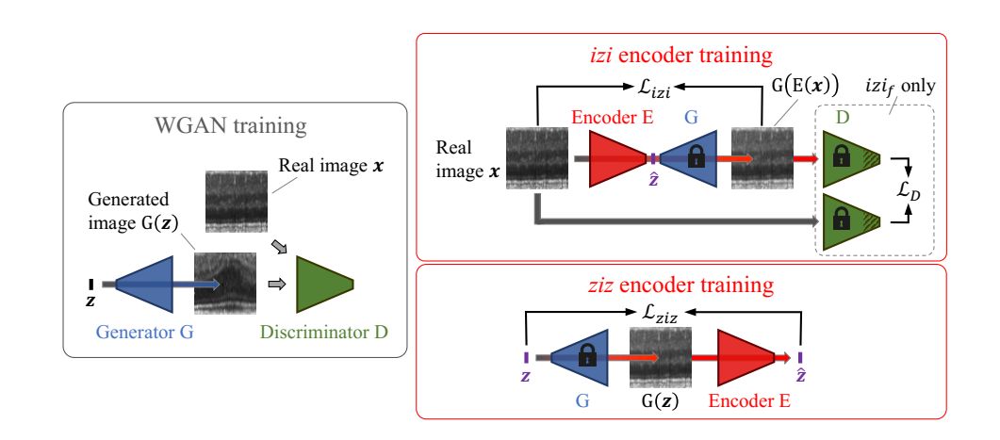
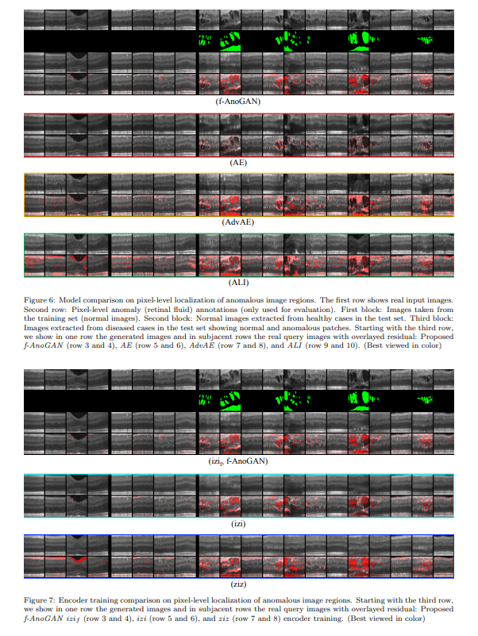
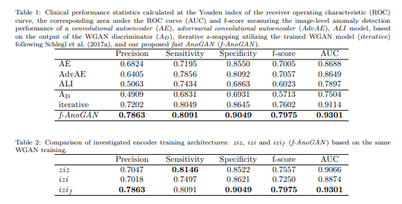

+++
# Date this page was created.
date = 2019-10-14
title = "f-AnoGAN: Fast unsupervised anomaly detection with generative adversarial networks"
summary = ""
external_link = ""
math = true
markup = "goldmark"
+++

## 1. どんなもの？
推論時に時間がかかってしまうAnoGANを高速化する枠組み．

## 2. 先行研究と比べてどこがすごい？
AnoGANでは，推論時に$z$から$x$へのmappingを行うために学習済みGANのDiscriminatorの結果と再構成誤差からLossを算出し，勾配降下法によって$z$を探索していた．
つまり，推論時にも”学習”のフェーズが存在し処理時間が長かった．

f-AnoGANでは，推論時の勾配降下による探索を無くし，推論の高速化を行った．

## 3. 技術や手法の"キモ"はどこ？
$z$ から$x$を推論する枠組みを3つ提案．

### ziz encoder
学習済みのGANのGeneratorを用いて，$z$をGeneratorに入力し，その出力をziz encoderに入力し得られた潜在ベクトルとの再構成誤差を最小化する．  
$n$は総画素数．
$$
L(z) = \frac{1}{n}|z - E(G(z))|^2
$$

### izi encoder
学習済みのGANのGeneratorを用いて，$x$をEncoderに入力し，その出力をizi encoderに入力し得られた画像との再構成誤差を最小化する．
$$
L(x) = \frac{1}{n}|x - G(E(x))|^2
$$
### izif encoder
izi encoderの派生形で，izi encoderのLossと同様の再構成誤差と，Discriminatorに$x$と$G(E(x))$を入力した際の中間層の出力の再構成誤差の和を最小化する．
$f(\cdot)$はDiscriminatorの中間層の出力で，$n_d$は$f(\cdot)$の次元数で$k$は重みパラメータ．．
$$
L(x) = \frac{1}{n}|x - G(E(x))|^2 + \frac{k}{n_d}|f(x)-f(G(E(x)))|^2
$$

### 異常度の算出
$$
A(x) = \frac{1}{n}|x - G(E(x))|^2 + \frac{k}{n_d}|f(x)-f(G(E(x)))|^2
$$

## 4. どうやって有効だと検証した？
AnoGANと同様にretinal spectral-domain optical coherence tomography (SD-OCT)をデータセットとして実験．
Autoencoder，AAE，ALI，WGANのDiscriminator，iterative(AnoGAN)と比較して精度も上回った．

## 5. 議論はあるか？
追加のEncoderをつけるという簡単な手法で高速化＆高精度化を果たした点がGood．
構成的にはGANomalyに近い感じがするが，精度比較のほどは果たして？

## 6. 次に読むべき論文はある？
* AnoGAN https://arxiv.org/abs/1703.05921
* GANomaly: Semi-Supervised Anomaly Detection via Adversarial Training  https://arxiv.org/abs/1805.06725
* Adversarially Learned Inference https://arxiv.org/abs/1606.00704
