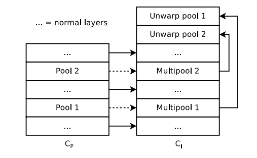
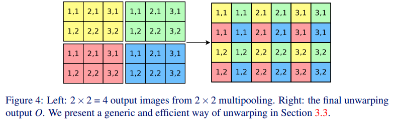
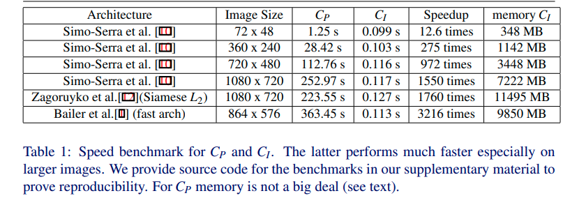

+++
# Date this page was created.
date = 2020-06-06
title = "Fast Dense Feature Extraction for CNNs"
summary = ""
external_link = "https://arxiv.org/abs/1805.03096"
categories = ["Feature Learning"]
rate = 5
math = true
markup = "goldmark"
+++

## 1. どんなもの？
* Patchで学習したCNNをOriginalに対して，sliding windowして特徴抽出する枠組みの改善
* ↑は計算が冗長で計算時間が長い
* Patchで学習したCNNを再学習することなく，pooling layerを置き換えるだけでOK

## 2. 先行研究と比べてどこがすごい？
* 大きい画像に対して，sliding windowして特徴抽出する方法は計算が冗長で計算時間が長い
    * sliding window使わない方法では，poolingやstride などで特徴抽出された画像は元画像よりかなり小さくなる
        * e.g.) VGGの場合は，224x224 -> 7x7で1/32のサイズになる
* Patchで学習したCNNを再学習することなく，pooling layerを置き換えるだけでOK

## 3. 技術や手法の"キモ"はどこ？
* 変数の定義
    * $I \in \R^{I_h \times I_w \times I_c}$ : Originalの入力画像
    * $P_{x, y} \in \R^{P_h \times P_w \times I_c}$ : 位置$(x,y)$のパッチ
    * $O_{x, y} = C_p(P_{x, y}) \in \R^{k}$ : 位置$(x,y)$のパッチを通常のCNN $C_p$でfeature extractして得られたベクトル
    * $O \in \R^{I_h \times I_w \times I_c}$ : 

sliding windowせず，$O \in \R^{I_h \times I_w \times I_c}$ が得られるモデル$C_L$を求めたい

### Layers without pooling
* poolingやstride convでないlayerは，Patchで学習したCNNを転用する

### Multipool to consider all locations
* Pooling LayerをMultipoolに置き換え
* 2x2のPoolingでは↓のように4つのPooling Patternが考えられる

$$
\operatorname{Pool}_{s \times s}^{x, y}(I)=\operatorname{Pool} _ {s \times s}\left(\operatorname{SHIF} T _ {y, x}(I)\right)
$$

Layerの出力は4つのPooling Patternの出力の集合．  
通常Poolingすると，解像度が落ちるがこの方法では落ちていない．

$$
L _ {I}^{\text {multipool}}=\\{\text {Pool} _ {s \times s}^{0,0}, \text {Pool} _ {s \times s}^{0,1}, \ldots, \text {Pool} _ {s \times s}^{0, s-1}, \ldots, \text {Pool} _ {s \times s}^{s-1,0}, \ldots, \operatorname{Pool} _ {s \times s}^{s-1, s-1}\\}
$$

### Unwarping
* 1個のMultipoolを持つCNNの出力は，Leftであり，それを並べ替えてRightにする

* 演算的には，(Leftのshape:$(s=2, s=2, \frac{I_h=4}{s=2}, \frac{I_w=6}{s=2}, k=1)$)
    * transpose dim=(1, 2) -> (2, 2, 2, 3, 1)
    * reshape (2x2, 2x3, 1) -> (4, 6, 1)

* $n$個のMultipoolを持つ場合は，出力のshapeは$(s^n, s^n, \frac{I_h}{s^n}, \frac{I_w}{s^n}, k)$
    * loop `for i in range(0, n)`
        * reshape  -> $(s^{n-i},  s^{n-i}, \frac{I_h}{s^{n-i}}, \frac{I_w}{s^{n-i}}, k)$ 
        * transpose dim=(1, 2) -> $(s^{n-i},  \frac{I_w}{s^{n-i}}, s^{n-i}, \frac{I_h}{s^{n-i}}, k)$
 
    * reshape -> $(I_h, I_h, k)$

※ 論文内の記述を理解できなかったので，プログラムの方から解釈してます↑

## 4. どうやって有効だと検証した？
GTX TITAN Xを使って，sliding windowと速度比較

## 5. 議論はあるか？
* Unwarpingの式の記述の仕方が理解できなかった
* Githubのプログラムはこれであってるのか？ 
    * reshapeとtranspose周り

## 6. 次に読むべき論文はある？
