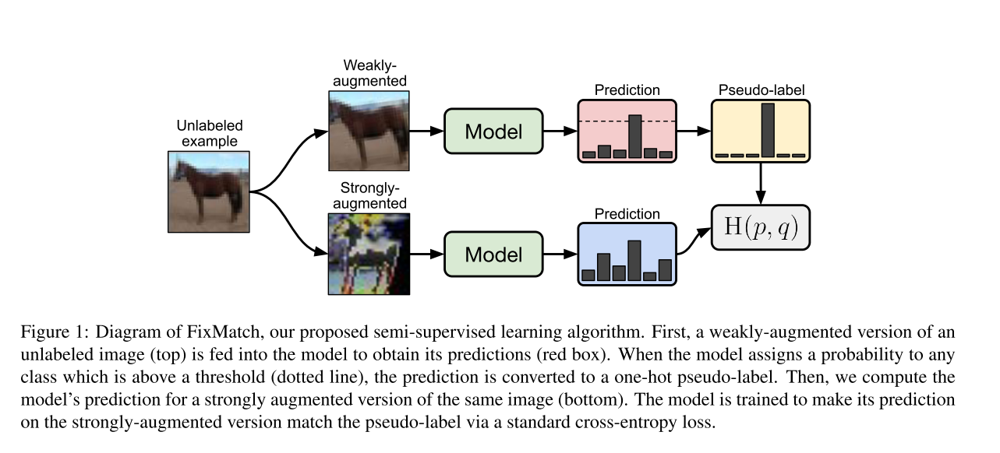
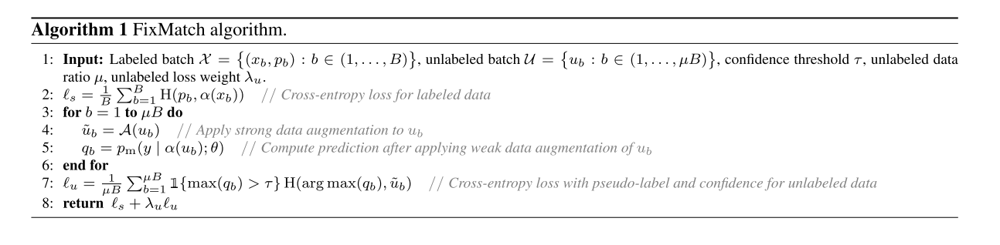
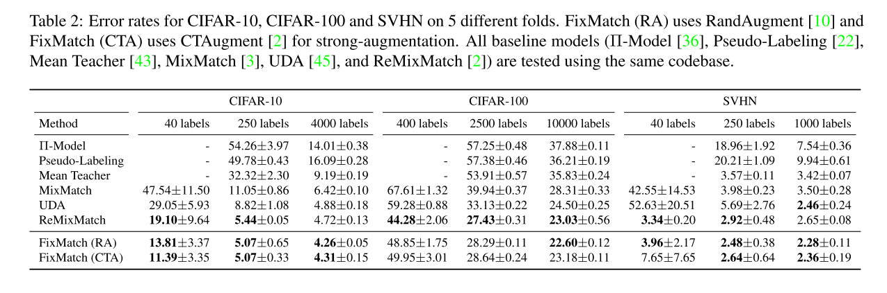
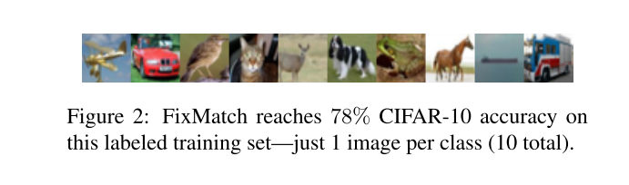

+++
# Date this page was created.
date = 2020-01-28
title = "FixMatch: Simplifying Semi-Supervised Learning with Consistency and Confidence"
summary = ""
external_link = "http://arxiv.org/abs/2001.07685"
categories = ["Semi-supervised Learning"]
rate = 5
math = true
markup = "goldmark"
+++

## 1. どんなもの？
* Pseudo labelとConsistency regularizationを組み合わせたSemi-supervised learning (SSL)
* 非常に単純な枠組みだが，Cifar10を40labels だけでerror率：11.39を達成

## 2. 先行研究と比べてどこがすごい？
* Pseudo labelとConsistency regularizationの組み合わせでSSLのSOTA

## 3. 技術や手法の"キモ"はどこ？
* **Pseudo label**と**Consistency regularization**の組み合わせ
* 変数の定義
    * $x_b$ : labeled training exmaple
    * $p_b$ : one-hot label
    * $\mathbb{X} = \{ (x_b, p_b): b \in (1, \cdots, B) \}$ : labelありデータの集合
    * $u_b$: unlabeled training exmaple
    * $\mathbb{U} = \{(u_b): b \in (1, \cdots, \mu B)\}$ : labelなしデータの集合
    * $H(p, q)$ : $p$, $q$のcrossentropy
### Consistency regularization
* loss関数は確率的なaugmentation $\alpha$と$p_m$を用いて，
$$
\sum_{b=1}^{\mu B}\left\|p_{\mathrm{m}}\left(y | \alpha\left(u_{b}\right)\right)-p_{\mathrm{m}}\left(y | \alpha\left(u_{b}\right)\right)\right\|_{2}^{2}
$$
* 確率的なので，↑は0にはならないことに注意
### Pseudo label
* $u_b$に対して，擬似的ラベル$q_b$を付与する
$$
q_b = p_m(y|u_b)
$$
* unlabeld dataに対するloss関数は，指示関数 $\mathbb{I}$，しきい値 $\tau$を用いて
$$
\frac{1}{\mu B} \sum_{b=1}^{\mu B} \mathbb{I}\left(\max \left(q_{b}\right) \geq \tau\right) \mathrm{H}\left(\hat{q}_{b}, q_{b}\right)
$$
$$
\hat{q}_{b} = argmax(q_b)
$$
### FixMatch

* labeled exmapleに対してはConsistency regularization (図の上側)
* $\alpha$は弱いaugmentation (e.g. filpとか軽微なshift)
$$
\ell_{s}=\frac{1}{B} \sum_{b=1}^{B} \mathrm{H}\left(p_{b}, p_{\mathrm{m}}\left(y | \alpha\left(x_{b}\right)\right)\right)
$$
* unlabeld exampleに対してはPseudo label(図の下側)
* $\mathcal{A}$は強いaugmentation (AutoAugmentベースの手法：RandAugment，CTAugment)
$$
\ell_{u}=\frac{1}{\mu B} \sum_{b=1}^{\mu B} \mathbb{I}\left(\max \left(q_{b}\right) \geq \tau\right) \mathrm{H}\left(\hat{q}_{b}, p_{\mathrm{m}}\left(y | \mathcal{A}\left(u_{b}\right)\right)\right)
$$
$$
q_b = p_m(y | \alpha(u_b))
$$

### Additional important factors
* weight decayが有効
* AdamよりSGDが良い
* learning scheduleにはcosine learning rate decayを使う
$$
\eta \cos \(\frac{7 \pi K}{16K} \)
$$
## 4. どうやって有効だと検証した？
* Cifar10，Cifar100，SVHNで実験
    * Cifar100以外はSOTA

* 下の10枚（つまり1クラス1枚）だけを用いてCifar10学習しても78%のAccuracy

## 5. 議論はあるか？
* Section 5は気が向いたら
* 単純な方法 + 少ラベルでこれほどの精度が出るのは驚き
* Goodfellow曰く**革命**


## 6. 次に読むべき論文はある？
1. David Berthelot, Nicholas Carlini, Ekin D. Cubuk, Alex Ku- rakin, Kihyuk Sohn, Han Zhang, and Colin Raffel. Remix- match: Semi-supervised learning with distribution matching and augmentation anchoring. In Eighth International Conference on Learning Representations, 2020.
2. Ekin D. Cubuk, Barret Zoph, Jonathon Shlens, and Quoc V. Le. Randaugment: Practical automated data augmen- tation with a reduced search space. arXiv preprint arXiv:1909.13719, 2019.
3. David Berthelot, Nicholas Carlini, Ian Goodfellow, Nicolas Papernot, Avital Oliver, and Colin A Raffel. Mixmatch: A holistic approach to semi-supervised learning. In Advances in Neural Information Processing Systems 32. 2019.