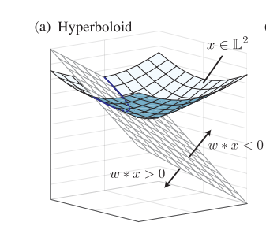
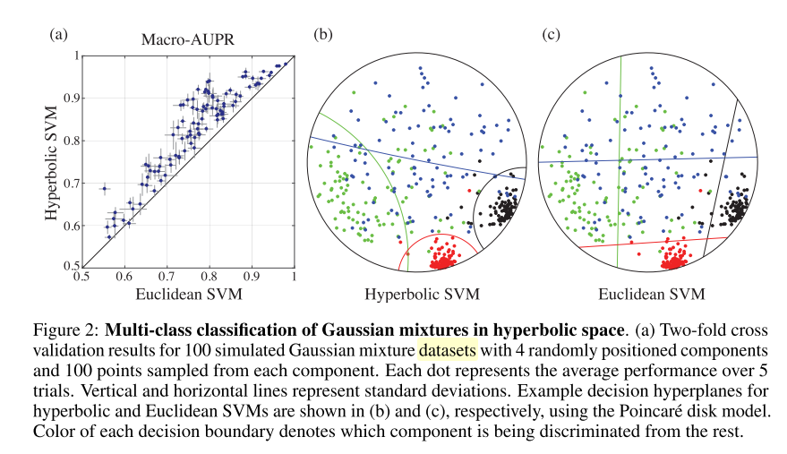
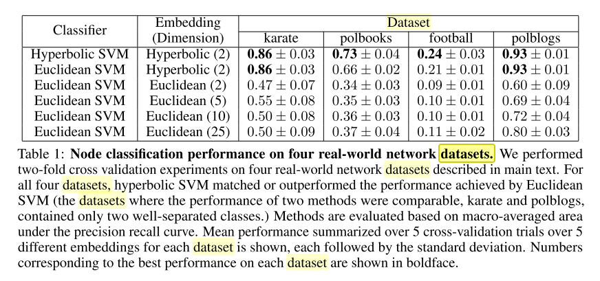

+++
# Date this page was created.
date = 2020-03-02
title = "Large-Margin Classification in Hyperbolic Space Hyunghoon"
summary = ""
external_link = "http://arxiv.org/abs/1806.00437"
categories = ["SVM"]
rate = 4
math = true
markup = "goldmark"
+++

## 1. どんなもの？
* SVMの距離をユークリッド空間ではなく，非ユークリッド空間で取る
* 具体的にはPoincare disk上とか

## 2. 先行研究と比べてどこがすごい？
* SVMの距離算出を比ユークリッド空間で行う
    * 階層構造を持つデータなどに対して精度良く識別ができる
    * textとかgraphとか

## 3. 技術や手法の"キモ"はどこ？
### 前提知識
#### Hyperbolid model
* 内積が$x*y = x_0y_0 - x_1y_2 - \cdots x_ny_n\$で定義されるMinkowski space
* $n$次元のhyperbolid model $\mathbb{L_n}$は$\mathbb{R} ^ {n+1}$の単位球の上半平面上にある
$$
\mathbb{L}^{n}=\left \\{ x: x=\left(x_{0}, \ldots, x_{n}\right) \in \mathbb{R}^{n+1}, x * x=1, x_{0}>0\right \\}
$$

#### Poincare Ball
* 有名なポアンカレ円盤
$$
\mathbb{B}^{n}=\left \\{ x: x=\left(x_{1}, \ldots, x_{n}\right) \in \mathbb{R}^{n},\|x\|^{2}<1\right \\}
$$
* hyperbolidの特殊な形と言える
$$
\left(x_{0}, \ldots, x_{n}\right) \in \mathbb{L}^{n} \Leftrightarrow\left(\frac{x_{1}}{1+x_{0}}, \ldots, \frac{x_{n}}{1+x_{0}}\right) \in \mathbb{B}^{n}
$$

https://qiita.com/hibit/items/5a49bedaa826fddf0a33

#### SVM
* 目的関数は
$$
\operatorname{minimize} _ {w \in \mathbb{R} ^ {n}} \frac{1}{2}\|w\|^{2}+C \sum_{j=1}^{m} \max \left(0,1-y^{(j)}\left(w^{T} x^{(j)}\right)\right)
$$
### Hyperbolic Support Vector Classification
* $x$からdecision boundaryまでの距離を下で定義
$$
\sinh ^{-1}\left(\frac{w * x}{\sqrt{-w * w}}\right)
$$
* 目的関数は
$$
\operatorname{minimize} _ {w \in \mathbb{R}^{n+1}}-\frac{1}{2} w * w+C \sum_{j=1}^{m} \max \left(0, \sinh ^{-1}(1)-\sinh ^{-1}\left(y^{(j)}\left(w * x^{(j)}\right)\right)\right)
$$
$$
\text{subject to } w * w<0
$$
## 4. どうやって有効だと検証した？
* GMM（混合数4）から発生させたデータに対して実験

* 4つのreal datasetに対して実験
    * 生で使うのではなく，embdして識別
    * 比較がずるい気がする

## 5. 議論はあるか？
* 精度云々は置いておいて，距離を非ユークリッド空間でとるアイデア

## 6. 次に読むべき論文はある？
* https://tech-blog.abeja.asia/entry/poincare-embeddings
* https://tech-blog.abeja.asia/entry/hyperbolic_ml_2019
* Nickel, M., & Kiela, D. (2018). Learning Continuous Hierarchies in the Lorentz Model of Hyperbolic Geometry. Retrieved from http://arxiv.org/abs/1806.03417