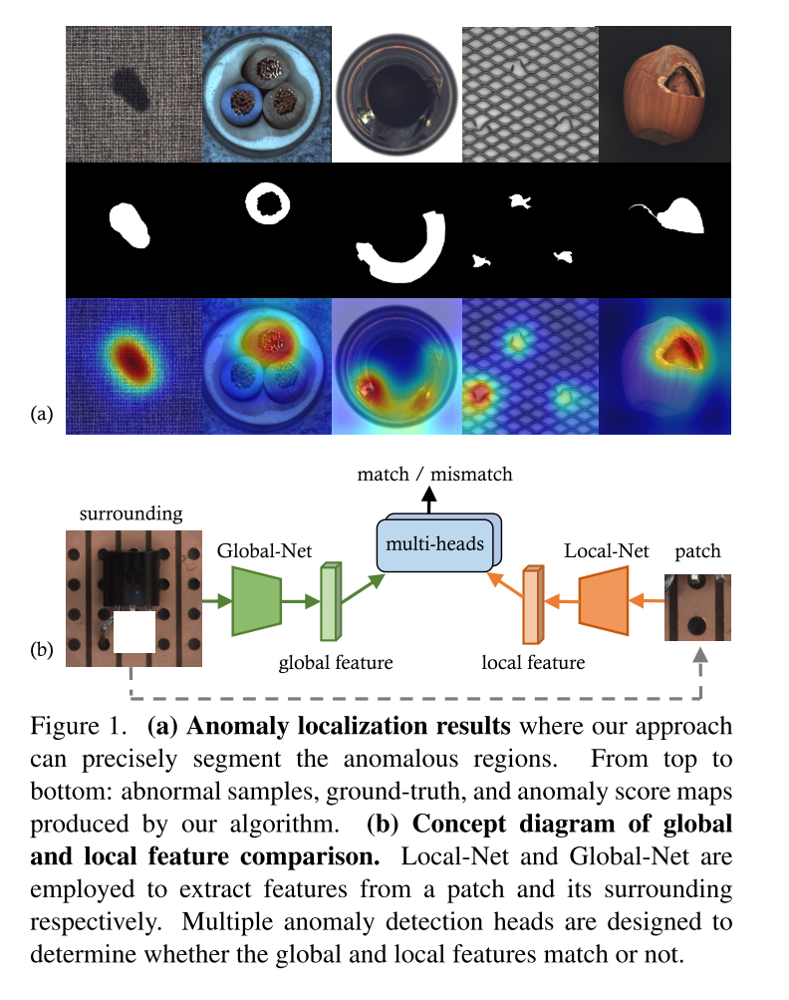
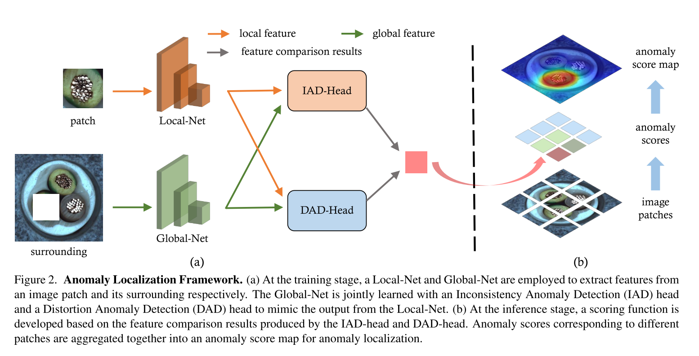
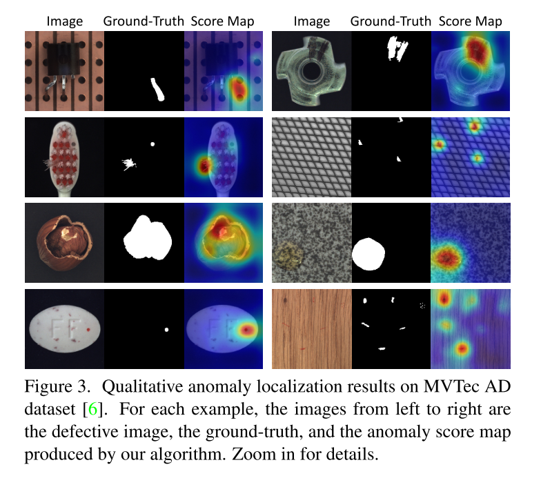
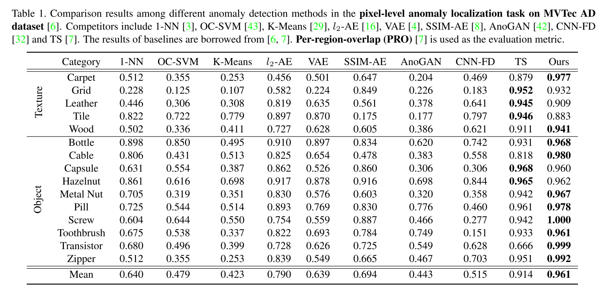

+++
# Date this page was created.
date = 2021-06-21
title = "Glancing at the Patch: Anomaly Localization With Global and Local Feature Comparison"
external_link = "https://openaccess.thecvf.com/content/CVPR2021/html/Wang_Glancing_at_the_Patch_Anomaly_Localization_With_Global_and_Local_CVPR_2021_paper.html"
categories = ["Anomaly Detection"]
tags = ["CVPR2021"]
rate = 5
math = true
markup = "goldmark"
summary = "local featureとglobal featureをそれぞれ別のNNより抽出し，その一致度を測ることで異常度算出する教師無し異常検知の枠組み．local featureは画像内のPatchから抽出，global featureはそのPatchを使用しないようにpartial convolutionすることで抽出．"
+++

## 1. どんなもの？
* pretrained modelをfine tuning，distillationするUnsupervised Anomaly Detection
* local featureとglobal featureをそれぞれ別のNNより抽出し，その一致度を測ることでscore算出
* local featureは画像内のPatchから抽出，global featureはそのPatchを使用しないようにpartial convolutionすることで抽出

## 2. 先行研究と比べてどこがすごい？
* 従来のADでは，
  * 画像全体を入力：global featureを獲得できるが，localizationができない
  * Patchを入力：global featureを獲得できない

## 3. 技術や手法の"キモ"はどこ？

### 変数の定義
* $\mathbf{I}$: 入力画像
* $\mathbf{p}$: Patch
* $\mathbf{M}$: mask
* $\mathcal{L}$: Local Network
* $\mathcal{R}$: pretrained model
* $\mathcal{D}$: $\mathcal{L}(\mathbb{p})$と$\mathcal{R}(\mathbb{p})$の次元数を合わせるDecoder
* $c_{ij}$: minibatch内の$\mathcal{L}(\mathbb{p})$の相関行列の$(i, j)$番目要素
* $\mathcal{G}$: Global Network
* $\mathcal{C}$: DADのhead

### 学習
#### Local feature
* pretrained modelからfine tuningと蒸留を同時に行うことで学習する
* knowledge distillation loss
$$
l_k = \| \mathcal{D}(\mathcal{L}(\mathbb{p})) - \mathcal{R}(\mathbb{p}) \|^2_2
$$
* compactness loss
$$
l_c = \Sigma_{i \not= j}{c_{ij}}
$$
* ↑2つを重みつき和して，
$$
l_{local} = \lambda_k l_k + \lambda_c l_c
$$
* {{< eq "l_{local}" >}}を最小化するように{{< eq "\mathcal{L}" >}}を事前に学習する
* local featureは
$$
\mathbf{Z}_l = \mathcal{L}(\mathbb{p})
$$
#### Global feature
* Loacal feature抽出のために使ったPatchをGlobal Networkでは使わないようにpartial convolution


x^{\prime} = \left\{\begin{array}{ll}
\mathbf{W}^{\mathbf{T}}(\mathbf{X} \odot \mathbf{M}) \frac{\operatorname{sum}(\mathbf{1})}{\operatorname{sum}(\mathbf{M})}+b, & \text { if } \operatorname{sum}(\mathbf{M})>0 \\
0, & \text { otherwise. }
\end{array}\right.


* global featureは

  \mathbf{Z}_g = \mathcal{G} \left( \mathbf{I}, \mathbf{M}_0 \right)


* IAD lossとDAD lossを最小化するよう学習する

  l = l_{IAD} + \lambda_t l_{DAD}

##### Inconsistency Anomaly Detection Head
* Inconsistency Anomaly Detection Head(IAD Head)をlocalとglobal featureの不整合を検出できるよう設計

  l_{IAD} = \frac{1}{n}\| \mathbf{Z}_l - \mathbf{Z}_g \|^2_2

##### Distortion Anomaly Detection Head
* Distortion Anomaly Detection Head(DAD Head)を画像内の歪みを検出できるように設計
  * {{< eq "\mathbf{Z}_l" >}}と疑似欠陥を付与したPatch{{< eq "\mathbf{Z}_l^-" >}}を分類できるようにする
  * {{< eq "\mathbf{Z}^*" >}}は{{< eq "\mathbf{Z}_l" >}}か{{< eq "\mathbf{Z}_l^-" >}}のいずれか
  * {{< eq "\mathbf{Z}_l" >}}のときは，{{< eq "\mathbf{Z}_l^-" >}}のときは

  p = \mathcal{C} \left( \mathbf{Z}^*, \mathbf{Z}_g \right)



  l_{DAD} = -\left( y\log{p} + (1-y)\log{(1-p)} \right)


### 推論
#### score
* inconsistency anomaly score

  s_{IAD} = \frac{1}{n} \| \mathbf{Z}_l - \mathbf{Z}_g \|^2_2

* distortion anomaly score

  s_{DAD} = 1 - \mathcal{C} \left( \mathbf{Z}_l, \mathbf{Z}_g \right)

* 重み付きで足し合わせて，

  s = \lambda_s s_{IAD} + (1-\lambda_s)s_{DAD}

#### localization
* overlapを許して，slinding windowすることでpatchを作り，score算出をしていく

## 4. どうやって有効だと検証した？
* MVTec で実験
  * PROにおいて，PaDiMを上回る

## 5. 議論はあるか？
* PROにおいてSoTA更新
* image levelのAUROCについて言及がない？

## 6. 次に読むべき論文はある？
