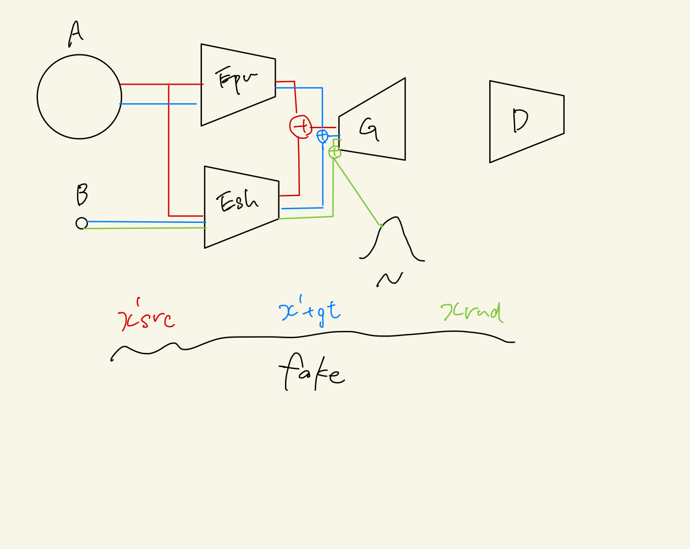
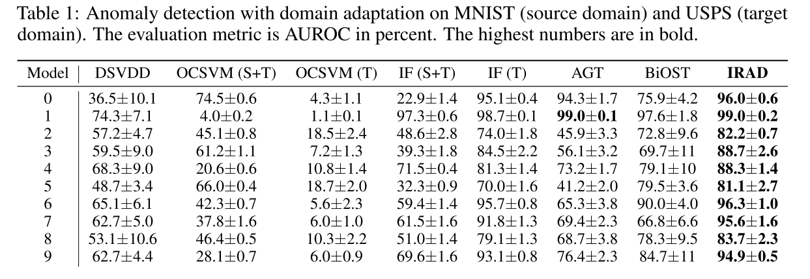
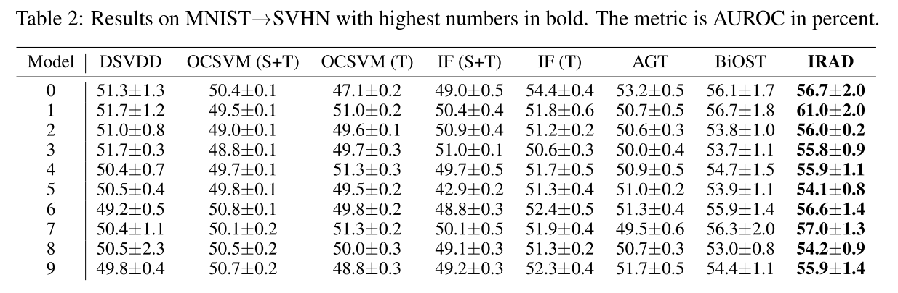

+++
# Date this page was created.
date = 2020-11-30
title = "Anomaly Detection with Domain Adaptation"
summary = ""
external_link = "https://arxiv.org/abs/2006.03689"
categories = ["Anomaly Detection", "Domain Adaptation"]
tags = []
rate = 4
math = true
markup = "goldmark"
+++

## 1. どんなもの？
* Anomaly Detection + Domain Adaptationの枠組み
* 大量のドメインAのデータと少量のドメインBのデータからAD

## 2. 先行研究と比べてどこがすごい？
* 従来研究では↓のどちらかだった
    * ドメインAのラベルが必要
    * ドメインBにも大量のデータが必要

## 3. 技術や手法の"キモ"はどこ？
### Obejctive
* domain invarianceの特徴を抽出することが目標
    * 共通の特徴を抽出する$E_{sh}$
    * ドメインAのprivate encoder$E_{pv}$
    * sourceの復元データ
    $$x^{\prime} _{src} = G(E _ {pv}(x _ {src}) + E _ {sh}(x _ {src}))$$
    * 共通の特徴とsource固有のデータからsourceを生成したデータ
    $$x^{\prime} _{tgt} = G(E _ {pv}(x _ {src}) + E _ {sh}(x _ {tgt}))$$
    * ランダムにサンプリングされた潜在変数と共通の特徴から生成したデータ
    $$x _ {rnd} = G(z + E _ {sh}(x _ {src}))$$
    * この3つをfakeで$x_{src}$をtrueとしてGANを学習    
    $$
    \min _ {\{E_{s h}, E_{p v}, G_{s r c}\}} \max _ {D _ {s r c}} V_{s r c}(D_{s r c}, G_{s r c}, E_{p v}, E_{s h})=  \newline
    \mathbb{E} _ {\boldsymbol{x} _ {s r c}}[\log D_{s r c}(\boldsymbol{x} _ {s r c})]+\mathbb{E} _ {\boldsymbol{x} _ {s r c}}[\log (1-D_{s r c}(\boldsymbol{x}_{s r c}^{\prime})]+
    +\mathbb{E} _ {\boldsymbol{x} _ {s r c}, \boldsymbol{x} _ {t g t}}[\log (1-D_{s r c}(\boldsymbol{x} _ {t g t}^{\prime})]+\mathbb{E} _ {\boldsymbol{x} _ {s r c}}[\log (1-D_{s r c}(\boldsymbol{x}_{r n d})]
    $$
    * cycle consistensy
    $$ l_1 = \| x_{src} - x^{\prime}_{src} \|_2 $$
    $$ l_2 = \| x_{src} - x^{\prime}_{tgt} \|_2 $$
    * $x_{src}$に対して，$E_{sh}$と$E_{pv}$で得られる特徴量が遠くなるように内積を最小化
    $$ l _ {dis} = \| E _ {sh}(x _ {src})^T E _ {pv}(x _ {src}) \| $$
    * 逆に共通の特徴が取れるようにするため内積の負を最大化
    $$ l _ {sim} = - \| E _ {sh}(x _ {src})^T E _ {pv}(x _ {tgt}) \| $$

    全てのLossを重み付き（$\alpha=1.0$，$\beta=0.5$）で足し算して最小化
    $$ V_{src} + \alpha(l_1 + l_2) + \beta(l_{dis} + l_{sim})  $$

### Anomaly Score
$E_{sh}(x)$に対してIsolation Forestを適用することで算出

## 4. どうやって有効だと検証した？
* SourceをMNIST，TargetをUSPSで実験

* SourceをMNIST，TargetをSVHNで実験

## 5. 議論はあるか？
* 複雑なLossだが安定性は？
* 他の枠組み応用は可能か？

## 6. 次に読むべき論文はある？