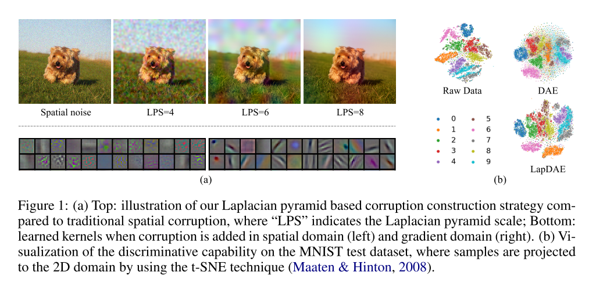
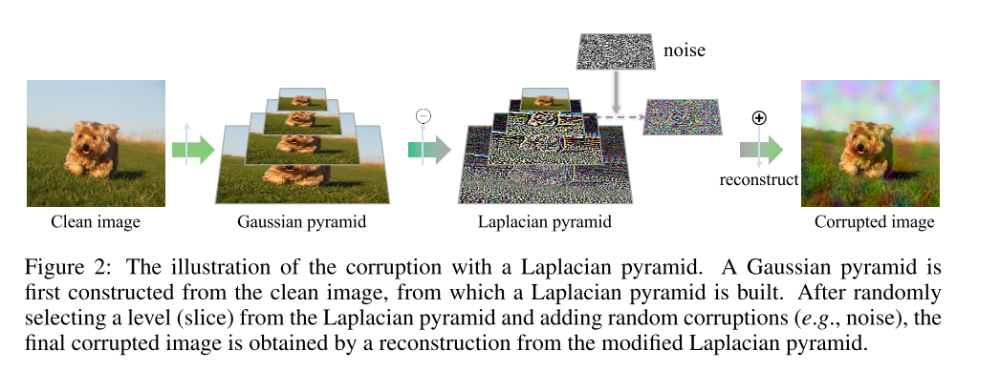
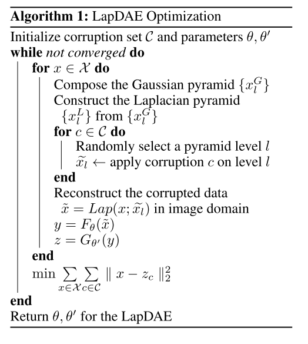
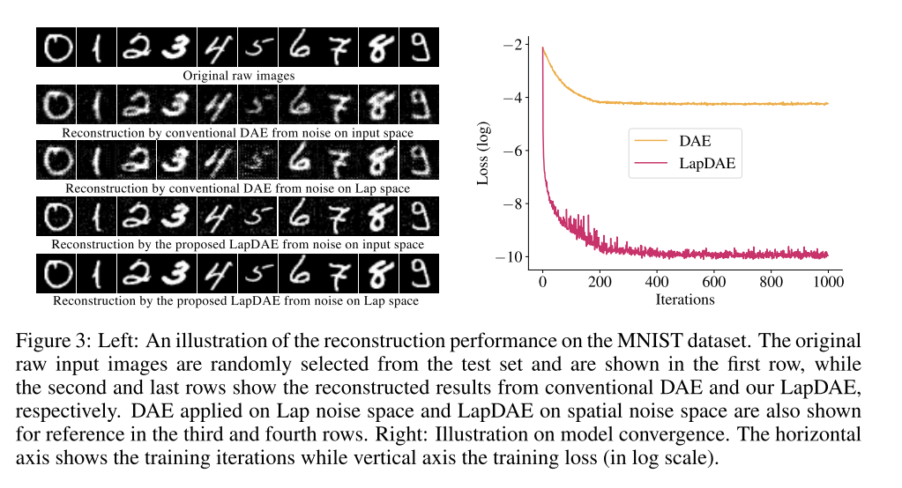
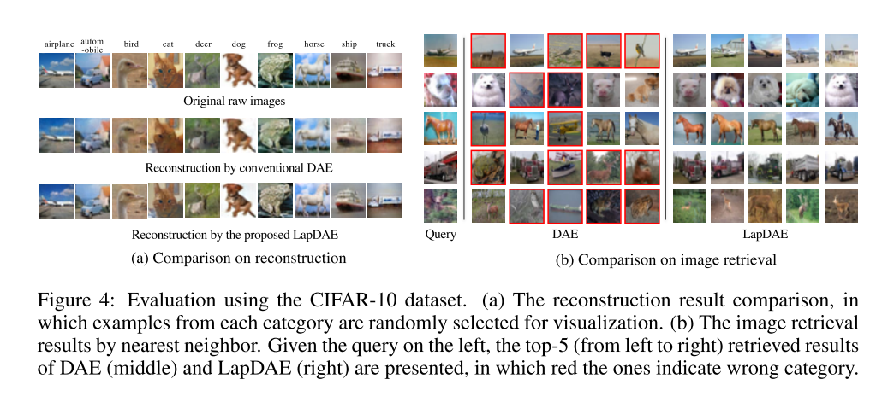
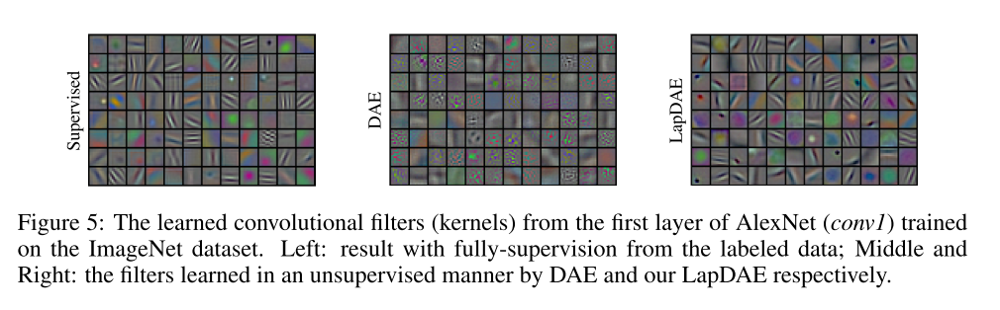
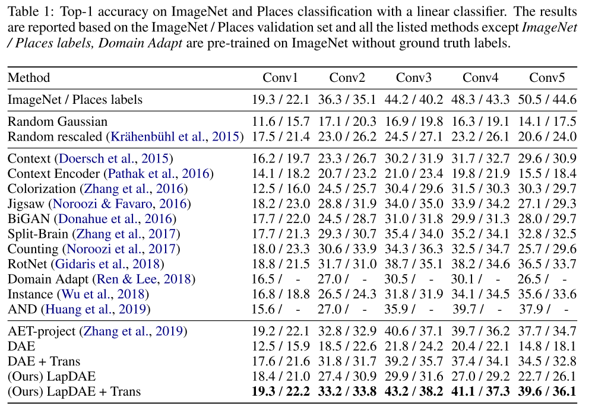
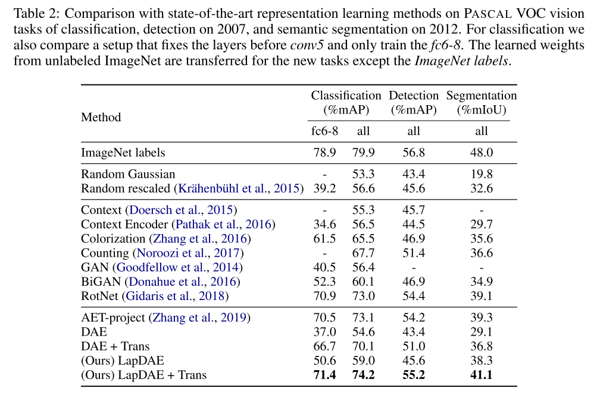

+++
# Date this page was created.
date = 2020-01-18
title = "Laplacian Denoising Autoencoder"
summary = ""
external_link = "https://openreview.net/forum?id=HygHtpVtPH"
categories = ["Representation Learning"]
math = true
markup = "goldmark"
+++

## 1. どんなもの？
* 表現学習の枠組み
* Denoising Autoencoderをベースにより良い特徴表現を獲得
* 具体的には，入力データにノイズを付加するのではなくLaplacian Pyramidのrandom level目でノイズを付加する

## 2. 先行研究と比べてどこがすごい？
* 通常のDAEより優れた特徴表現の獲得
* 他の表現学習とは異なり，domain assumptionやpseudo labelを必要としない

## 3. 技術や手法の"キモ"はどこ？
* 入力データにノイズを付加するのではなく，**Laplacian Pyramidのlevel $l$層目でノイズを付加する**
* $l$層目のLaplacian Pyramid $x_l^L$ は，$l$層目のGaussian Pyramid $x_l^G$ を用いて下式
$$
x_l^L = x_l^G - upsample(x_{l+1}^G)
$$
* $x_0^G$ は元画像に等しい．上式の $l$ を 0 に向かって繰り返し計算すると元画像が求められる
$$
x_l^G = x_l^L + upsample(x_{l+1}^G)
$$
* **この繰り返しの途中でノイズを付加する**

* algorithmは以下
    * $c \in C$ はどんなノイズを付加するかのセットと要素
    * objectiveは通常のMSE

## 4. どうやって有効だと検証した？
### MNIST
* 通常のDAEと比較して，input space, laplacian spaceどちらのnoiseに対しても正確に復元できていることがわかる
* 再構成Lossも低い

### CIFAR10
* 再構成，画像検索共に通常のDAEより高精度

### Imagenet
* Supervised learningと同じようなconv filterが学習できている

* conv層後の特徴を線形分類したときの精度比較．
    * LapDAEとAET-project[1]を組み合わせた LapDAE + Transが最高精度

* Pascal VOCに転移学習しても最高精度

## 5. 議論はあるか？
* 単純な方法でより良い特徴表現の獲得に成功している
* objectiveはMSEのままなのに，blurが軽減されているのはなぜ？
* Gaussian pyramidを作る際にGaussian filterはかけてる？

## 6. 次に読むべき論文はある？
1. Zhang, L., Qi, G.-J., Wang, L., & Luo, J. (2019). AET vs. AED: Unsupervised Representation Learning by Auto-Encoding Transformations rather than Data. Retrieved from http://arxiv.org/abs/1901.04596
