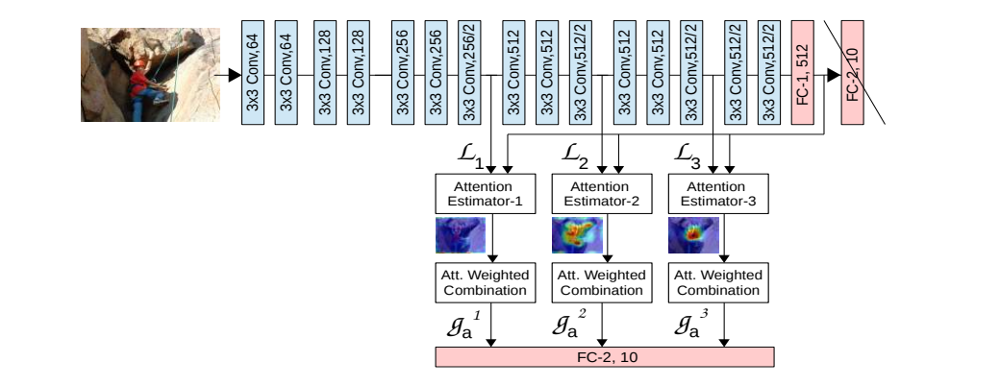
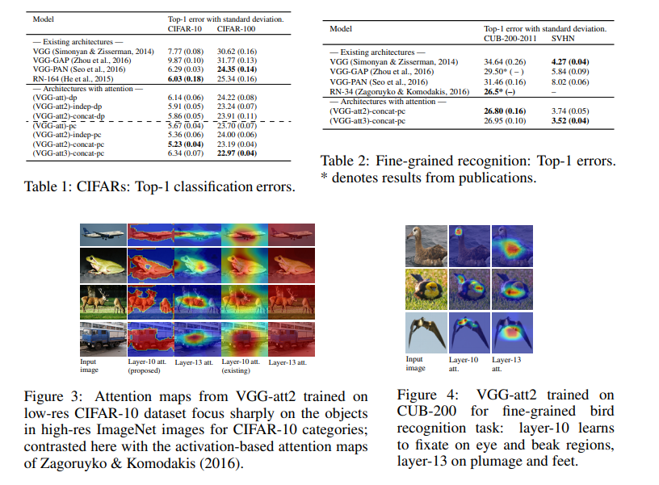
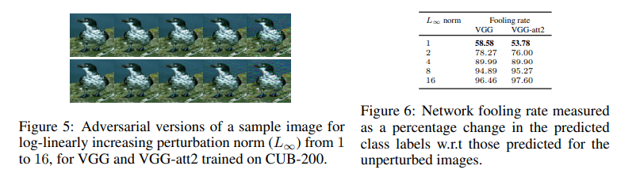
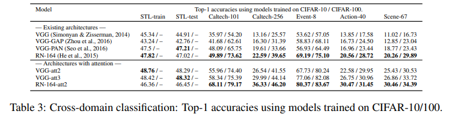

+++
# Date this page was created.
date = 2018-05-06
title = "Learn to Pay Attention"
summary = ""
external_link = ""
math = true
katex = true
+++

## 1. どんなもの？
Attention Mapを使ってCNNが分類を行うときに使う有効な視覚的情報の空間的なサポートを見つけ出し，利用することで一般物体認識の精度を向上させる．

## 2. 先行研究と比べてどこがすごい？
* Saliency Mapを用いることで有効な領域の情報を重視し，無関係な情報を抑制する
* Local feature vector (CNNの中間層の出力)とGlobal feature vector (CNNの後段のFCの出力)を組み合わせる
* 適合度によって重要なLocal feature vectorだけを分類に活用する

## 3. 技術や手法の"キモ"はどこ？
学習可能なAttention Estimatorを通常のCNNに付け加えるだけで，Attention Mapによる解釈性，精度の向上．

1. $S$個のAttention Moduleを↑のようにCNNに加える．$s$個目のAttention Moduleは，長さ$M$のベクトル$N$個からなる集合である．

2. $s$個目のlocal feature vectorは
$$ \mathbf{L^s} = { \mathbf{l_1^s}, \mathbf{l_2^s}, ..., \mathbf{l_N^s} } $$
ここで，ベクトルの長さ$M$はFeature Mapのチャネル数に等しく，ベクトルの個数$N$はFeature Mapの画素数に等しい．

3. 全結合層で各ベクトルの長さをglobal feature vector $\mathbf{g}$の長さ$M'$に揃える
$$ \mathbf{\hat{l^s_i}} = w\cdot{\mathbf{l_i^s}} $$

4. local feature vectorとglobal feature vectorから各画素のCompatibility scoresを求める
$$ C^s(\mathbf{\hat{L_s}}, \mathbf{g}) = {c_1^s, c_2^s, ..., c_n^s} $$
$$ c_i^s = \mathbf{\hat{l^s_i}} \cdot{\mathbf{g}} $$

5. Compatibility scoresに対して，softmaxを適用してAttention Mapを算出
$$ a_i^s = \frac{exp(c_i^s)}{\sum_j^N exp(c_j^s)} $$

6. 各モジュールの出力はAttention MapとFeature Mapの内積
$$ \mathbf{g^s} = \sum_i^n a_i^s \cdot{\mathbf{l_i^s}} $$

7. 最終的には，全Moduleの出力を連結することでModule全体の出力として，最後にFC層

$$ \mathbf{g_a} = { \mathbf{g_1}, \mathbf{g_2}, ..., \mathbf{g_S}} $$
$$ O = W \cdot{\mathbf{g_a}} $$

## 4. どうやって有効だと検証した？
CIFAR10，CIFAR100，CUB200，SVHNで実験．
BaselineであるVGG，VGG+GAP, VGG+PAN, ResNet164と比較して精度向上．
浅い層では局所的な情報を重視し，深い層では物体全体の情報を重視していることがわかる

## 5. 議論はあるか？
Adversarial AttackやCross Domainな認識タスクに対しても有効であることが示されている．

## 6. 次に読むべき論文はある？
