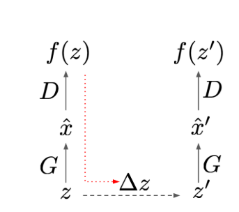
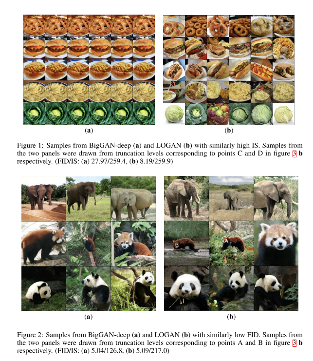
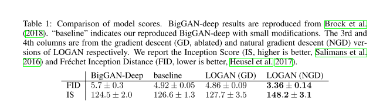

+++
# Date this page was created.
date = 2019-12-10
title = "LOGAN: Latent Optimisation for Generative Adversarial Networks"
summary = ""
external_link = "https://openreview.net/forum?id=rJeU_1SFvr"
categories = ["GAN"]
math = true
markup = "goldmark"
+++

## 1. どんなもの？
* GANのIS，FIDを向上させる系の論文
* BigGANベースに大きなアーキテクチャの変更なしに高精度な生成．

## 2. 先行研究と比べてどこがすごい？
* ベースはBigGAN
* 潜在変数をDiscriminatorが騙されやすいように更新した後，パラメータを更新することでhigh qualityとdiversityを実現

## 3. 技術や手法の"キモ"はどこ？
* キモは，**潜在変数をDiscriminatorが騙されやすいように更新した後，パラメータを更新すること**
### Latent Optimisation
* 潜在変数をDiscriminatorが騙されやすいように更新した後，パラメータを更新する
$$
\Delta z = \alpha \frac{\partial f(z)}{\partial z} 
$$
$$
z' = z + \Delta z
$$
* ここで，f(z)は$z$をGeneratorに入力し得られたデータをDiscriminatorに与えることで得られる出力

### Natural Gradient Descent
* 更新する$z$の空間はユークリッド空間でないことが多い．
* 通常の勾配法ではうまく更新できないことがある．
* 自然勾配法を用いて$z$を更新する．

$$
\Delta z = \alpha F^{-1} \frac{\partial f(z)}{\partial z} = \alpha F^{-1}g 
$$

* ここで，$F$はフィッシャー情報行列
* $F$の算出はcost大なので，近似すると($\beta$はハイパラの定数)

$$
F' = g \cdot g^T + \beta I
$$

$$
\Delta z=\alpha\left(\frac{I}{\beta}-\frac{g g^{T}}{\beta^{2}+\beta g^{T} g}\right) g=\frac{\alpha}{\beta}\left(1-\frac{\|g\|^{2}}{\beta+\|g\|^{2}}\right) g
$$ 

## 4. どうやって有効だと検証した？
Imagenetの生成で実験．
baseline(a)よりLOGAN(b)の方がdiversityのある生成ができている．

## 5. 議論はあるか？
* $z$を更新するだけでここまで精度が上がるのは驚き
* ただ，baselineがBigGANなので庶民には手が出せない
* dynamicの話とかappendixについては，まだ見れてない

## 6. 次に読むべき論文はある？
