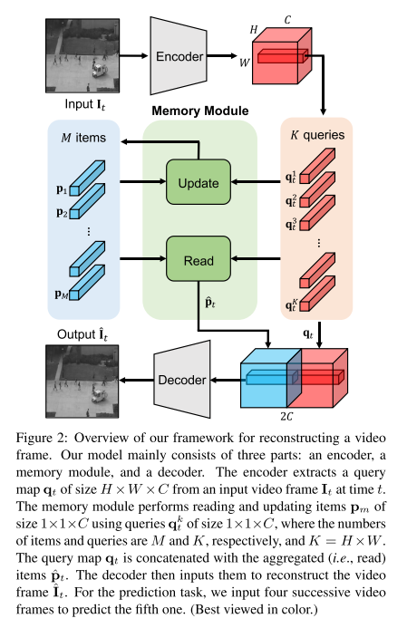
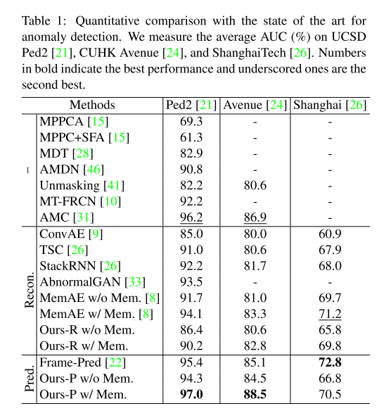
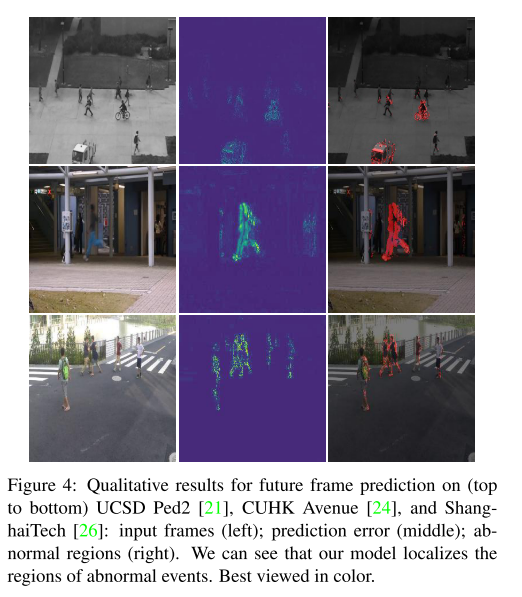

+++
# Date this page was created.
date = 2020-06-16
title = "Learning Memory-guided Normality for Anomaly Detection"
summary = ""
external_link = "http://arxiv.org/abs/2003.13228"
categories = ["Anomaly Detection"]
tags = ["CVPR2020"]
rate = 5
math = true
markup = "goldmark"
+++

## 1. どんなもの？
* Unsupervised な Anomaly Detectionの枠組み
* Autoencoder系のADで，Autoencoderの潜在特徴MAPにMemory構造を採用
* Autoencoderの汎化問題と正常パターンの多様性という問題にアタック
* 再構成のlossベース，フレーム予測のlossベースどちらにも展開可能
## 2. 先行研究と比べてどこがすごい？
* Autoencoder系のADは，Autoencoderの表現力がありすぎて，異常も異常として復元してしまい再構成誤差が出ない問題があった
* またAutoencoder系のADは，正常分布のdiversityをカバーしきれないことがあった（表現力とのトレードオフ？）

## 3. 技術や手法の"キモ"はどこ？
* 変数の定義
    * $I_t$: $t$ frame目の入力画像
    * $\hat{I}_t$: $t$ frame目のAutoencodeされた画像
    * $q_t \in \R^{H \times W \times C}$: $t$ frame目のquery map
    * $q^k_t \in \R^{C} (k=1, \cdots, K)$: $t$ frame目，position $k$ のquery vector（$K=H \times W$）
    * $p_m \in \R^{C} (m=1,\cdots,M)$: $m$番目のmemory vector
### Memory
#### Read
* query vectorのmemory vectorの内積をsoftmaxして，matching probability $w^{k,m}_t$を求める
$$
w _ {t}^{k, m}=\frac{\exp \left(\left(\mathbf{p} _ {m}\right)^{T} \mathbf{q} _ {t}^{k}\right)}{\sum _ {m^{\prime}=1}^{M} \exp \left(\left(\mathbf{p} _ {m^{\prime}}\right)^{T} \mathbf{q} _ {t}^{k}\right)}
$$
* 各クエリ$q^k_t$に対して，memory vectorを使った重み付き平均を求めることで，新しい特徴とする
$$
\hat{\mathbf{p}} _ {t}^{k}=\sum _ {m^{\prime}=1}^{M} w _ {t}^{k, m^{\prime}} \mathbf{p} _ {m^{\prime}}
$$
* $q_t$と$\hat{p}_t$を結合して，Decoderに入力する

#### Update
* 相関MAPを求める．↑の$w _ {t}^{k, m}$の式と似ているけど，softmaxのaxisが$k$方向
$$
v _ {t}^{k, m}=\frac{\exp \left(\left(\mathbf{p} _ {m}\right)^{T} \mathbf{q} _ {t}^{k}\right)}{\sum_{k^{\prime}=1}^{K} \exp \left(\left(\mathbf{p} _ {m}\right)^{T} \mathbf{q} _ {t}^{k^{\prime}}\right)}
$$

* 最大値で正規化
$$
v^{\prime k, m} _ {t} = \frac{v_{t}^{k, m}}{\max _ {k^{\prime} \in U _ {t}^{m}} v _ {t}^{k^{\prime}, m}}
$$

* 重み付き平均を加算して更新．$f$はL2-norm
$$
\mathbf{p}^{m} \leftarrow f\left(\mathbf{p}^{m}+\sum_{k \in U_{i}^{m}} v_{t}^{\prime k, m} \mathbf{q}_{t}^{k}\right)
$$

* updateはtraining, test段階両方で行う．動画にはnormalとabnormalなフレームが混在してることがある．abnormalのときにはメモリのupdateを行わない
    * 基準は$\mathcal{E} _ {t}$がしきい値$\gamma$以上
    * $i, j$は入出力画像のposition
$$
\mathcal{E} _ {t}=\sum_{i, j} W _ {i j}\left(\hat{\mathbf{I}} _ {t}, \mathbf{I} _ {t}\right)\left\|\hat{\mathbf{I}}_{t}^{i j}-\mathbf{I} _ {t}^{i j}\right\| _ {2}
$$

$$
W _ {i j}\left(\hat{\mathbf{I}} _ {t}, \mathbf{I} _ {t}\right)=\frac{1-\exp \left(-\left\|\hat{\mathbf{I}} _ {t}^{i j}-\mathbf{I} _ {t}^{i j}\right\| _ {2}\right)}{\sum_{i, j} 1-\exp \left(-\left\|\hat{\mathbf{I}} _ {t}^{i j}-\mathbf{I} _ {t}^{i j}\right\| _ {2}\right)}
$$

### Training Loss
* 3つのLossの重み付き和
$$
\mathcal{L} = \mathcal{L}_{rec} + \lambda_c \mathcal{L} _ {compact} + \lambda_s \mathcal{L} _ {separate}
$$
#### Reconstruction loss
* 普通のL2誤差．全フレーム分の合計．
$$
\mathcal{L}_{rec} = \Sigma^T_t \| \mathbf{\hat{I}_t} - \mathbf{I_t} \| _ 2
$$

#### Feature compactness loss
* query $\mathbf{q^k_t}$と一番近いmemory $\mathbf{p}_p$を近づけることで，正常パタンのパタン内分散を小さくする
$$
\mathcal{L} _ {compact} = \Sigma^T_t \Sigma^K_k \| \mathbf{q^k _ t} - \mathbf{p} _ p \| _ 2
$$

#### Feature separateness loss
* Feature compactness lossを極めると全ての特徴が1点に落ちればよくなるので，それを防ぐために2番目に近いmemory $\mathbf{p}_n$ をquery $\mathbf{q^k_t}$からmargin $\alpha$ 分遠ざける
$$
\mathcal{L} _ {\text {separate }}=\sum _ {t}^{T} \sum _ {k}^{K}\left[\left\|\mathbf{q} _ {t}^{k}-\mathbf{p} _ {p}\right\| _ {2}-\left\|\mathbf{q} _ {t}^{k}-\mathbf{p} _ {n}\right\| _ {2}+\alpha\right] _ {+}$$

### 異常度の算出
* query と memoryのL2
$$
D(\mathbf{q_t}, \mathbf{p})=\frac{1}{K}\Sigma^K_k \| \mathbf{q^k_t} - \mathbf{p_p} \| _ 2
$$
* 入出力のPSNR．$N$はピクセル数
$$
P(\mathbf{\hat{I} _ t}, \mathbf{I}) = 10 \log_10 \frac{\max(\mathbf{I _ t})}{\| \mathbf{\hat{I} _ t} - \mathbf{I} \| ^2 _ 2 / N}
$$

* $t$ frame目の異常度は
$$
\mathcal{S} _ {t}=\lambda\left(1-g\left(P\left(\hat{\mathbf{I}} _ {t}, \mathbf{I} _ {t}\right)\right)\right)+(1-\lambda) g\left(D\left(\mathbf{q} _ {t}, \mathbf{p}\right)\right)
$$

* ↑の$g()$はmin-max normalization．2つの異常度のバランスをとる
$$
g\left(D\left(\mathbf{q} _ {t}, \mathbf{p}\right)\right)=\frac{D\left(\mathbf{q} _ {t}, \mathbf{p}\right)-\min _ {t}\left(D\left(\mathbf{q} _ {t}, \mathbf{p}\right)\right.}{\max _ {t}\left(D\left(\mathbf{q} _ {t}, \mathbf{p}\right)\right)-\min _ {t}\left(D\left(\mathbf{q} _ {t}, \mathbf{p}\right)\right)}
$$
## 4. どうやって有効だと検証した？
* Ped2, Avenue, Shanghaiの3つ異常動画検出データセットで実験
    * 画像は$256 \times 256$
    * $H=W=32, C=512, M=10$
* フレーム予測versionが最も精度高い

## 5. 議論はあるか？
* testの際にもメモリ更新は面白い
* 再構成系のモデルがあまり精度高くないのが残念

## 6. 次に読むべき論文はある？
* D. Gong,L. Liu,V. Le,B. Saha,M. R. Mansour,S. Venkatesh,and A. van den Hengel: “Memorizing Normality to Detect Anomaly: Memory-augmented Deep Autoencoder for Unsupervised Anomaly Detection,”(2019). [my note](https://salty-vanilla.github.io/portfolio/post/memorizing_normality_to_detect_anomaly_memory-augmented_deep_autoencoder_for_unsupervised_anomaly_detection/)