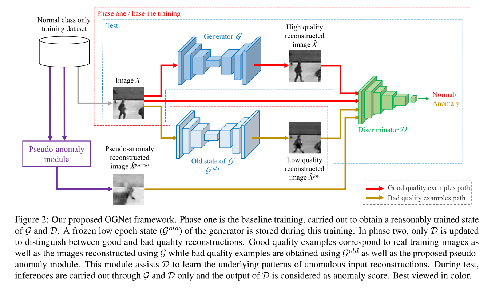
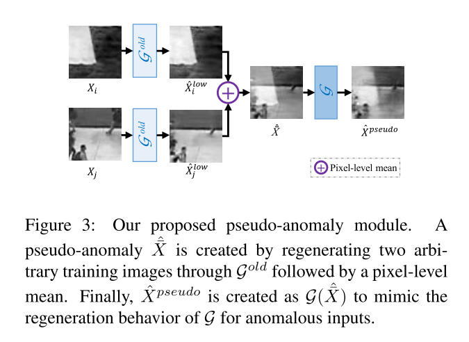
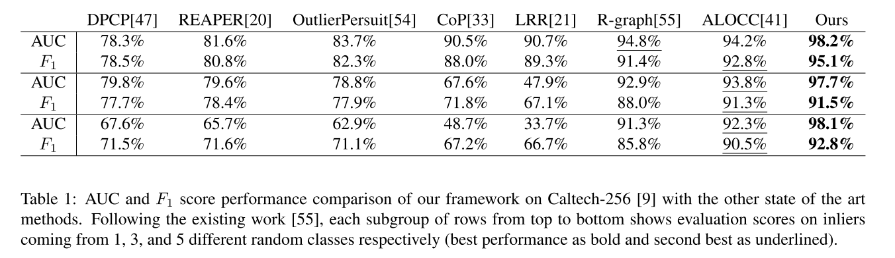
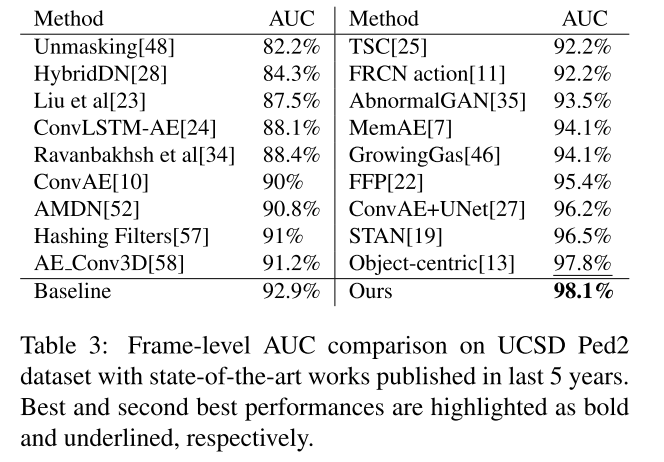
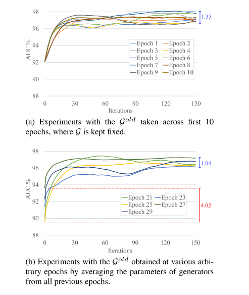
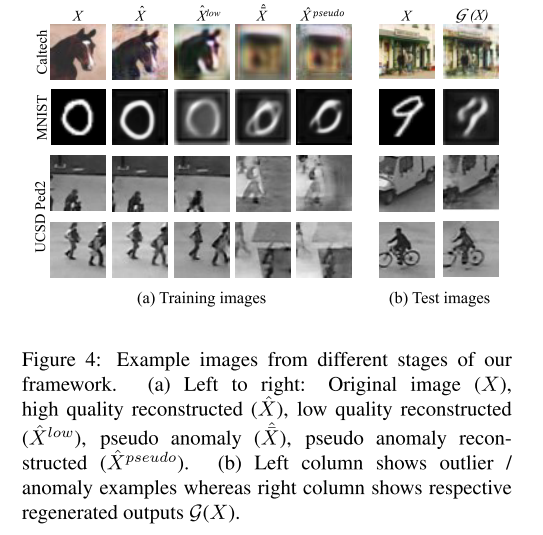

+++
# Date this page was created.
date = 2020-08-05
title = "Old Is Gold: Redefining the Adversarially Learned One-Class Classifier Training Paradigm"
summary = ""
external_link = "https://arxiv.org/abs/2004.07657"
categories = ["Anomaly Detection"]
tags = ["CVPR2020"]
rate = 4
math = true
markup = "goldmark"
+++

## 1. どんなもの？
* 2stage のtrainingのAnomaly Detection
* 完ぺきではないGenerator $\mathcal{G}_{old}$が1st stage，そこからgood/bad 判定のDiscriminatorの学習を行う
* GAN系のADモデル特有の精度不安定が解消

## 2. 先行研究と比べてどこがすごい？
* Generatorのみを使うADモデル（Autoencoder含む）は訓練データに稀に異常が入っていると失敗する
* Generator + DiscriminatorのADモデルは精度が不安定
* $\mathcal{G}_{old}$は↑2つを改善したモデル

## 3. 技術や手法の"キモ"はどこ？

* 変数の定義
    * $X \sim p_t$ : 正常データ
    * $\tilde{X} \sim p_t +\mathcal{N}_\sigma$ : 正常データ + ノイズ
    * $\mathcal{G}$ : Generator (Autoencoder)
    * $\mathcal{D}$ : Discriminator

### 1st phase
* GAN + DAE (Reconstruction) lossで$G$と$D$を訓練

$$
\min  _ {\mathcal{G}} \max _ {\mathcal{D}}\left(\mathbb{E} _ {X \sim p_{t}}[\log (1-\mathcal{D}(X))] + \mathbb{E} _ {\tilde{X} \sim p _ {t}+\mathcal{N} _ {\sigma}}[\log (\mathcal{D}(\mathcal{G}(\tilde{X})))]\right)
$$

$$
\mathcal{L}_R = \| X - \mathcal{G}(\tilde{X}) \|^2
$$

$$
\mathcal{L} = \mathcal{L}_{\mathcal{G}+\mathcal{D}} + \lambda \mathcal{L}_R
$$

* ここで **数Epoch後（low-epoch generator ）** のweightsを保存しておく．=> $\mathcal{G}_{old}$ 
* この段階でDiscriminatorの役割は real / fake の判定

### 2nd phase
#### Good / Bad quality exmaples
* Good quality examples : 正常データ $X$
* Bad quality examples : ${G} _ {old}$ による生成データ $\mathcal{G}_{old}(X)$ と Pseudo anomaly $\mathcal{G}(\hat{\bar{X}})$

$$
\hat{X}=\frac{\mathcal{G}^{old}\left(X_{i}\right)+\mathcal{G}^{\text {old}}\left(X _ {j}\right)}{2}=\frac{\hat{X} _ {i}^{\text {low}}+\hat{X} _ {j}^{\text {low}}}{2}, \text { where } i \neq j
$$

#### training
* $\mathcal{D}$のみ最適化

$$
\begin{array}{l}
\max _ {\mathcal{D}}\left(\alpha \mathbb{E} _ {X}[\log (1-\mathcal{D}(X))]+\right. \\\ (1-\alpha) \mathbb{E} _ {\hat{X}}[\log (1-\mathcal{D}(\hat{X}))]+\beta \mathbb{E} _ {\hat{X}^{l o w}}\left[\log \left(\mathcal{D}\left(\hat{X}^{low}\right)\right)\right]+ \\\ \left.\quad(1-\beta) \mathbb{E}_{\hat{X}^{pseudo}}\left[\log \left(\mathcal{D}\left(\hat{X}^{pseudo}\right)\right)\right]\right)
\end{array}
$$

### 異常度の算出
* 2nd phaseでGood / Bad quality exmaplesの識別ができる$\mathcal{D}$が得られるので，

$$
OCC = 
    \begin{cases}
      \text { normal class } & \text { if } \mathcal{D}(\mathcal{G}(X))<\tau  \\\\ \text { anomaly class } & \text { otherwise. }
    \end{cases}
$$

## 4. どうやって有効だと検証した？
* Caltech-256で実験

* Ped2で実験

* 何Epoch目で$mathcal{G}_{old}$作ればよいか実験 ⇒ 結構ロバスト

* Caltech と Ped2のGood / Bad quality exmaples

## 5. 議論はあるか？
* $\mathcal{G}_{old}$のネーミングセンス良き
* MVTec ADではどうなる？

## 6. 次に読むべき論文はある？
