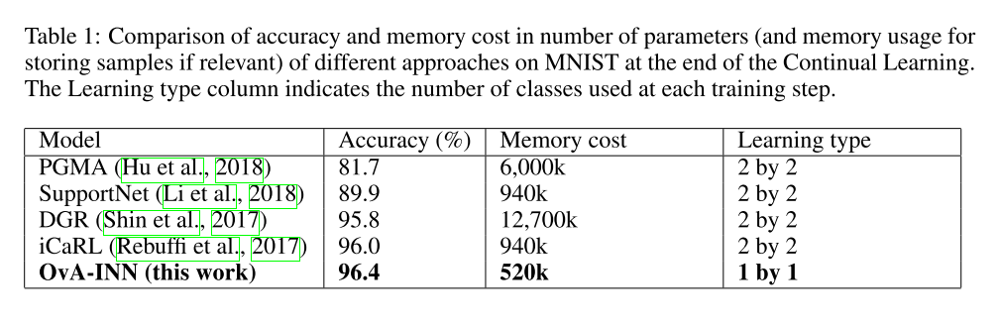
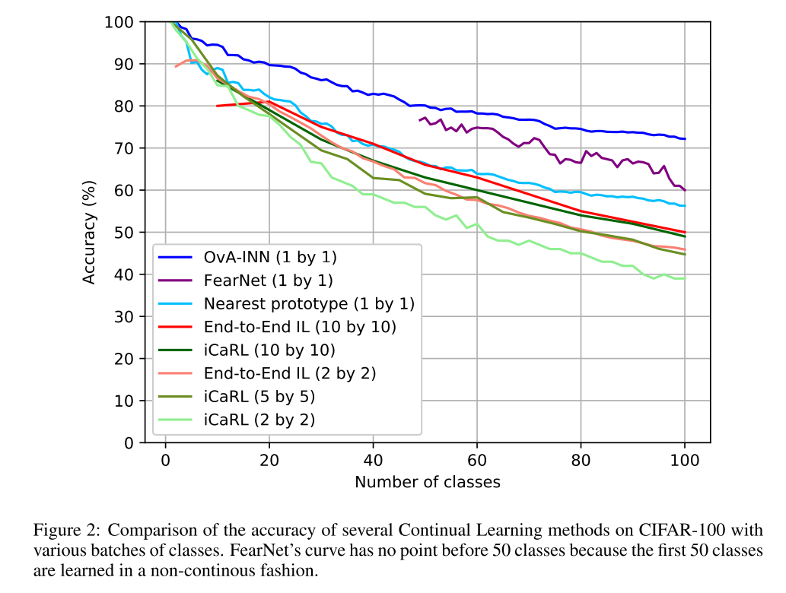

+++
# Date this page was created.
date = 2020-01-20
title = "OvA-INN: Continual Learning with Invertible Neural Networks"
summary = ""
external_link = "https://openreview.net/forum?id=rJxcBpNKPr"
categories = ["Continual Learning", "Flow Based"]
rate = 1
math = true
markup = "goldmark"
+++

## 1. どんなもの？
* 継続学習の枠組み
* 1クラスごとに，NICEを学習することで追加クラスに対応

## 2. 先行研究と比べてどこがすごい？
* 1クラスごとに学習するので，学習済みのデータは消しても良い
* クラス数の追加は好きなだけできる
* catastrophic forgetting を回避

## 3. 技術や手法の"キモ"はどこ？
* クラスごとにNICEを学習することで，OoD問題に持っていく

### NICE
* invertibleな生成モデル
* 潜在変数を仮定し，尤度最大化
    * OvA-INN では標準正規分布を仮定
    * 最大化する対数尤度は下式
$$
l_{i}(x)=\sum_{d} \log \left( p_{d} \left(f_{i, d}(x)\right)\right)=-\sum_{d} \frac{1}{2} f_{i, d}(x)^{2}+\sum_{d} \log \left(\frac{1}{\sqrt{2 \pi}}\right)=-\frac{1}{2}\left\|f_{i}(x)\right\|_{2}^{2}+\beta
$$

### OvA-INN (One vs All - Invertible Neural Networks)
* 任意のクラス数分のNICEを用意して，それぞれ最適化
* クラスそれぞれにNICEがあるので，forgetするわけはない
* クラス数が増えてもincremental に学習ができる
* $i$番目のクラスのNICE $f_i$のNLL
$$
\mathcal{L}\(\mathcal{X} _ i)= \frac{1}{\| \mathcal{X} _ i \|} \sum_{x \in \mathcal{X} _ i} \|f_{i}(x)\|_{2}^{2}
$$
* OvA-INN の最終的な推論のラベルは
$$
y^{*}=\underset{y=1, \ldots, t}{\arg \min }\left\|f_{y}(x)\right\|_{2}^{2}
$$
## 4. どうやって有効だと検証した？
### MNIST
* MNISTをincremental に学習させて，Acc算出
* 従来手法よりも優秀

### CIFAR100
* クラス数が増えても，精度があまり落ちない

## 5. 議論はあるか？
* クラス数分だけ，NICEがあるならforgetしないのは当たり前では？
* Flow based model がOoD 検出には使えないかも？という問題には全く触れていない[1]
* ICLR2020 reject

## 6. 次に読むべき論文はある？
1. Choi, H., Jang, E., & Alemi, A. A. (2018). WAIC, but Why? Generative Ensembles for Robust Anomaly Detection. Retrieved from http://arxiv.org/abs/1810.01392
