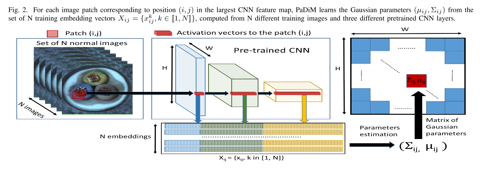
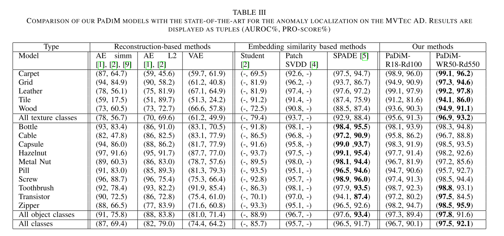
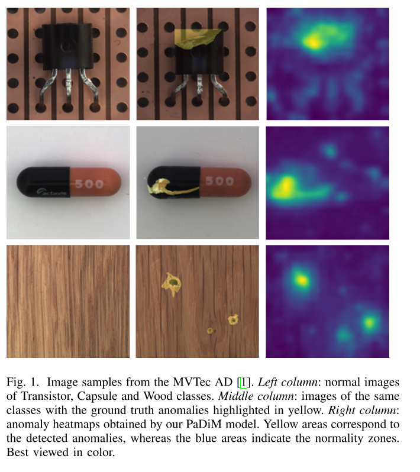
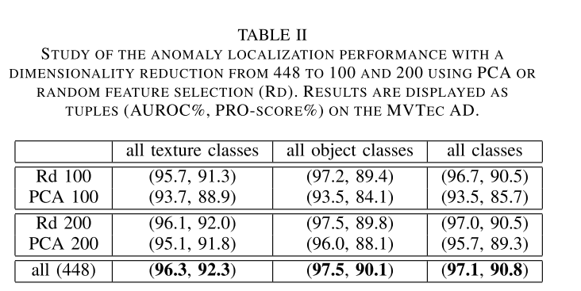

+++
# Date this page was created.
date = 2021-05-01
title = "PaDiM: a Patch Distribution Modeling Framework for Anomaly Detection and Localization"
summary = ""
external_link = "https://arxiv.org/abs/2011.08785"
categories = ["Anomaly Detection"]
tags = ["ICPR2020"]
rate = 5
math = true
markup = "goldmark"
+++

## 1. どんなもの？
* ImageNetで事前学習済みモデルを利用した異常検知
* 事前学習モデルで得られる特徴Mapを用いる
* MVTecでSoTA

## 2. 先行研究と比べてどこがすごい？
* NNの更新などは一切なく，学習するパラメータは平均ベクトルと共分散行列の集合のみ
* kNNなどを使わないので，推論が高速

## 3. 技術や手法の"キモ"はどこ？
### 学習

1. Pretrained modelから多重解像度な特徴Mapを抽出
2. アップサンプリングして，1番空間解像度の大きい特徴Mapと空間解像度を揃えて，  
$H \times W \times N$のtensorにする
3. これらを$N$次元ベクトルの$H \times W$個の集合と考え，訓練データ（正常のみ）から得られる特徴Mapに対して，position毎に平均ベクトルと共分散行列を求める

### 推論
1. テストデータに対して，Pretrained modelから特徴Map抽出
2. 学習で求めたpositino毎の平均ベクトルと共分散行列からマハラノビス距離を算出

$$
A(x) = \sum_h^H{ \sum_w^W { \sqrt{ \( x_{hw} - \mu_{hw } \)^T\Sigma_{hw}^{-1}\( x_{hw} - \mu_{hw } \)  }  } } 
$$

## 4. どうやって有効だと検証した？
* MVTec でSoTA
  * 実際の外観検査に近づけるために，±10度のrandom rotaionを加えた
  * $256 \times 256$にリサイズし，$224 \times 224$にセンタークロップ

* 特徴MapのチャンネルをPCAで次元削減したり，ランダム選択したりしても，精度に影響はなかった

## 5. 議論はあるか？
* 非常に単純な枠組みだが，SoTA
* MVTecの精度はほぼ限界なので，Beyond MVTec AD求む
* random rotationの影響を実験すべき

## 6. 次に読むべき論文はある？