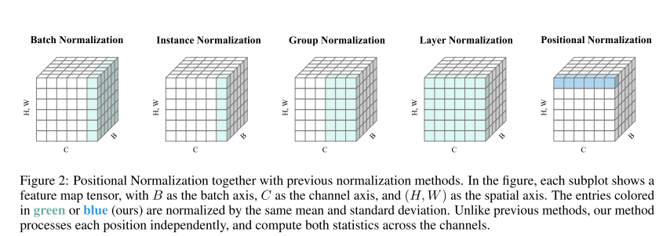
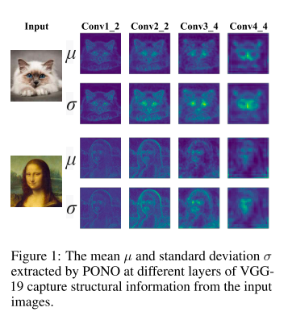
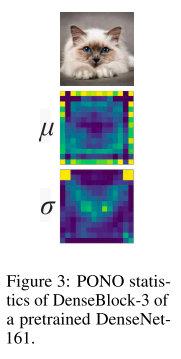
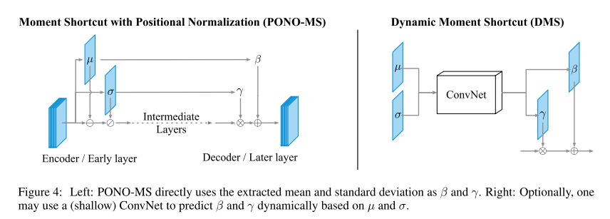
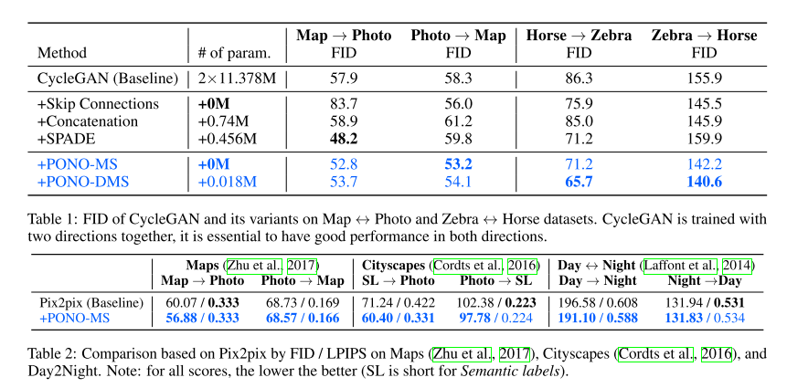
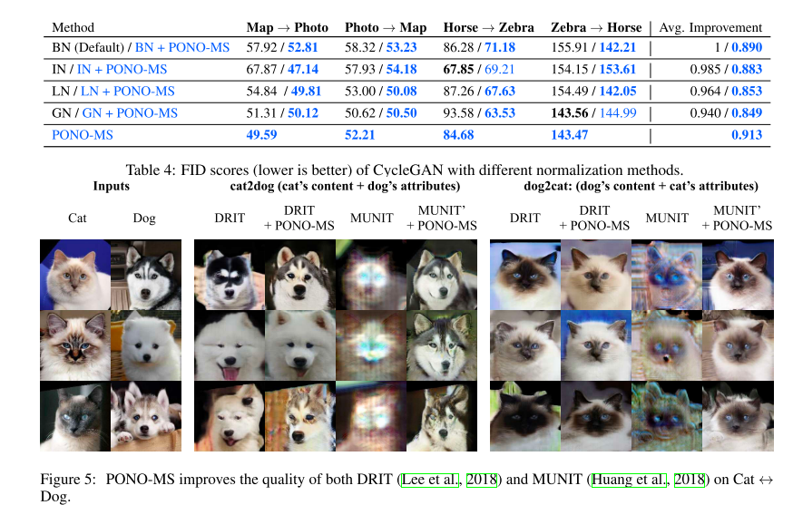

+++
# Date this page was created.
date = 2019-12-17
title = "POSITIONAL NORMALIZATION"
summary = ""
external_link = "http://arxiv.org/abs/1907.04312"
categories = ["Normalization"]
math = true
markup = "goldmark"
+++

## 1. どんなもの？
* pixelごとにチャネル方向に串刺しにして正規化する系の正規化手法
* Encoder-Decoder構造（Domain transferなど）に適用すると良い生成

## 2. 先行研究と比べてどこがすごい？
* BN，LN，INなどとは違って，空間解像度を保った正規化なのでstructuralな情報が残せる
* もちろん収束は早くなるし，安定もする

## 3. 技術や手法の"キモ"はどこ？
### Positional Normalization

* feature mapの各Pixel（position)ごとにチャネル方向にstaticsを求める
* つまり，staticsのshapeは（b, h, w)

$$
\mu_{b, h, w}=\frac{1}{C} \sum_{c=1}^{C} X_{b, c, h, w}, \quad \sigma_{b, h, w}=\sqrt{\frac{1}{C} \sum_{c=1}^{C}\left(X_{b, c, h, w}^{2}-\mu_{b, h, w}\right)+\epsilon}
$$

$$
X_{b, c, h, w}^{\prime}=\gamma\left(\frac{X_{b, c, h, w}-\mu}{\sigma}\right)+\beta
$$

* VGGにponoを差し込んでみると，画像の構造をstaticsが捉えているように見える

* ただDenseNetでは，map端に望まない反応が見られる

### Moment Shortcut

* Encoder-Decoder構造において，Encoderのponoで得られたstd $\sigma$を$\gamma$，mean $\mu$を$\beta$として
$$
x' = \gamma x + \beta
$$
* CycleGANやPix2Pixで有効
* $\mu$,$\sigma$に対して，convして，$\beta,\gamma \in \mathbb{R}^{B \times H \times W \times C}$にしてからAffineするDynamic Moment Shortcutも提案

## 4. どうやって有効だと検証した？
* Domain transfer (Map <-> Photo, Horse <-> Zebra)で実験
* CycleGAN (baseline)を上回るのはもちろん，SPADEにも勝っている
* parameter数も少ない

## 5. 議論はあるか？
* 情報量的には軽量版Unetと感じた
* Unetはパラメータ数，計算量も格段に多くなるのでGood
* MUNITはlatent spaceにたどり着かないかもしれない情報がでるけど，大丈夫なのか

## 6. 次に読むべき論文はある？
