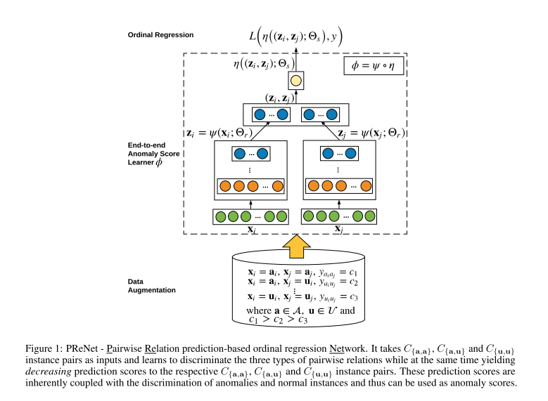
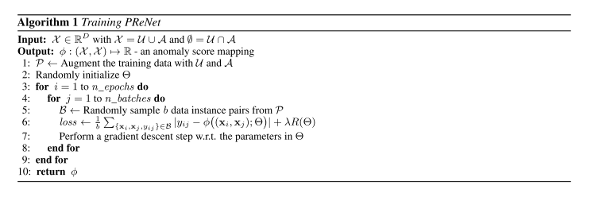
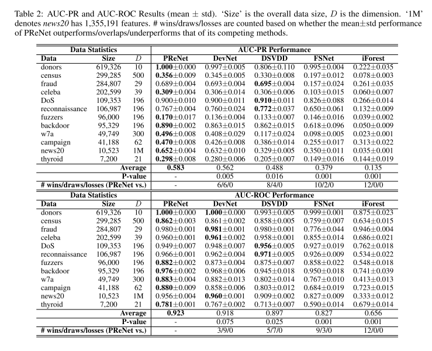

+++
# Date this page was created.
date = 2020-02-26
title = "Deep Weakly-supervised Anomaly Detection"
summary = ""
external_link = "https://arxiv.org/abs/1910.13601"
categories = ["Anomaly Detection"]
rate = 4
math = true
markup = "goldmark"
+++

## 1. どんなもの？
* 大量の正常データと少量の異常データからAnomaly Detectionを行う
* 入力は2入力でWeight SharingされたNNから得られた特徴ベクトル同士を結合して異常度回帰

## 2. 先行研究と比べてどこがすごい？
* 正常データからAnomaly Detectionモデルを作れるのは当たり前
* 実利用においては，少量の異常データを如何にうまく使うかが求められる
* DevNetの異常度のreference scoreがデータに一切依存していないことを改善？

## 3. 技術や手法の"キモ"はどこ？
* **P**airwise **Re**lation を学習
* 大量の正常データと**少量の異常データ**からAnomaly Detectionを行う
* テスト時には正常データと異常データと比較することで異常度算出

### 変数の定義
* $\mathcal{U} = \\{ u_1, u_2, \cdots, u_N \\}$ : unlabeled samples (正常データとごく少量の異常データ)
* $\mathcal{A} = \\{ a_1, a_2, \cdots, a_K \\}$ : labeled samples (少量の異常データ)
* その他の変数は下を参照

### Loss関数
$$
\underset{\Theta}{\arg \min } \frac{1}{|\mathcal{B}|} \sum_{\mathbf{x} _ {i}, \mathbf{x} _ {j}, y_{i j} \in \mathcal{B}}\left|y_{i j}-\phi\left(\left(\mathbf{x} _ {i}, \mathbf{x}_{j}\right) ; \Theta\right)\right|+\lambda R(\Theta)
$$

* $\mathcal{B}$ は$\mathcal{U}$(正常)と$\mathcal{A}$(異常)からサンプリングされたサンプルで構成
* $c_1 < c_2 < c_3$
* 異常/異常の組み合わせ : $y=c_1$ (めちゃめちゃ遠くに)
* 異常/正常の組み合わせ : $y=c_2$ (遠くに)
* 正常/正常の組み合わせ : $y=c_3$ (近くに)

### 異常度の算出
$$
s_{\mathbf{x}_{k}}=\frac{1}{2 E}\left[\sum_{i=1}^{E} \phi\left(\left(\mathbf{a}_{i}, \mathbf{x}_{k}\right) ; \Theta^{*}\right)+\sum_{j=1}^{E} \phi\left(\left(\mathbf{x}_{k}, \mathbf{u}_{j}\right) ; \Theta^{*}\right)\right]
$$

* $x_k$が異常なら$s_{x_k}$が大（理論値 : $c_1 + c_2$）
* $x_k$が正常なら$s_{x_k}$が小（理論値 : $c_2 + c_3$）

## 4. どうやって有効だと検証した？
* 様々なAD datasetでSoTA
    * Deep SVDD: AD．タスクに合わせてenhanceしたモデルを実装したとのこと
    * prototypical networks (FSNet) : few-shot classification
    * iForest: AD
    * DevNet: 筆者のmethod

## 5. 議論はあるか？
* $c_1$, $c_2$, $c_3$のチューニングは必要？
* サンプリング方法を同じにしたSiamse Networkとの比較は？
* Deep SVDDをどうenhanceしたか？

## 6. 次に読むべき論文はある？
