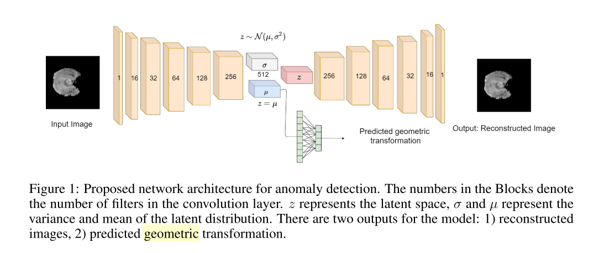
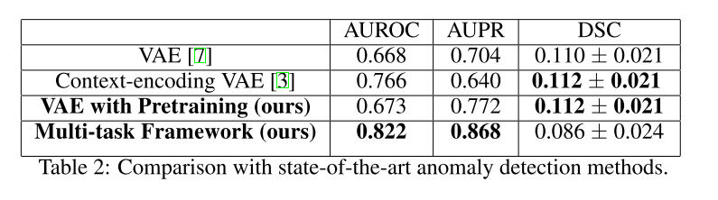

+++
# Date this page was created.
date = 2020-11-26
title = "Self-Supervised Out-of-Distribution Detection in Brain CT Scans"
summary = ""
external_link = "http://arxiv.org/abs/2011.05428"
categories = ["Anomaly Detection"]
tags = []
rate = 2
math = true
markup = "goldmark"
+++

## 1. どんなもの？
* Anomaly Detectionの枠組み
* AE系とGEOM系を組み合わせた

## 2. 先行研究と比べてどこがすごい？
* AE系とGEOM系を組み合わせた
* ↑以外に新規性はないが調査までに

## 3. 技術や手法の"キモ"はどこ？
### Architecture
* 構造はVAE系

### Objective
* 再構成誤差

$$
\mathcal{L} _ {c r}=\left\|\left(x_{i}-f\left(\hat{x} _ {i}\right)\right)\right\|_{2}
$$

* GEOM誤差．VAEの平均に対して分類を行う

$$
\mathcal{L} _ {geo}=- \sum^N_i q_i \log g (\tilde{x_{q_i}})
$$

* 全体のloss

$$
\mathcal{L} _ {multitask} = \mathcal{L}_{geo} + \epsilon \mathcal{L} _ {cr}
$$

### Anomaly score
$$
score = (1-\lambda)s_g + \lambda s_r
$$
$$
s_g = - \sum^N_i q_i \log g (\tilde{x_{q_i}})
$$
$$
s_r = \alpha \times \| x_i-f(x_i) \|_2
$$

## 4. どうやって有効だと検証した？
* 脳のCTスキャンデータで実験

## 5. 議論はあるか？
* 比較手法が少ない

## 6. 次に読むべき論文はある？