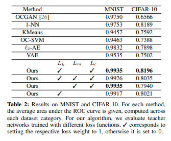
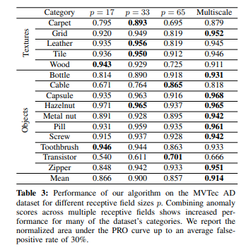
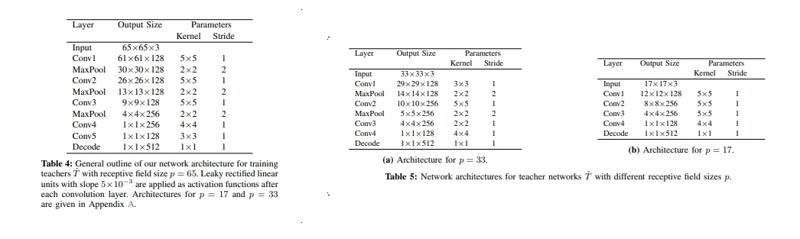

+++
# Date this page was created.
date = 2020-06-07
title = "Uninformed Students: Student-Teacher Anomaly Detection with Discriminative Latent Embeddings"
summary = ""
external_link = "https://arxiv.org/abs/1911.02357"
categories = ["Anomaly Detection"]
rate = 5
math = true
markup = "goldmark"
+++

## 1. どんなもの？
* Unsupervised な Anomaly Detectionの枠組み
* Large Imageに対して，Patchで学習してAnomalyのSegmentationが可能
* 自然画像で学習したTeacherと工業製品で学習する複数のStudentモデル

## 2. 先行研究と比べてどこがすごい？
* Unsupervised な Anomaly DetectionのSegmentaionにはAutoencoder系があったが再構成誤差によるもので，不正確だった
* transfer learningの枠組みは今まで工業製品のAnomaly Detectionでは使いづらかった
    * Domainの違い
    * 解像度の違い

## 3. 技術や手法の"キモ"はどこ？
* 変数の定義
    * $ \mathcal{D} = \\{ I_1, I_2, \cdots, I_N \\} $ : データセット
    * $I_n \in \R^{h \times w \times ch}$ : 入力画像
    * $S_i(I_n) \in \R^{h \times w \times d}$ : $i$番目のstudent networkに入力すると，入力と同じサイズのfeature mapが生成される
    * $T(I_n) \in \R^{h \times w \times d}$ : teacher networkも同様
    * $y_{r, c} \in \R^d$ : $S_i(I)$のMapのposition $r, c$における特徴ベクトル．
    * $p_{r, c} \in \R^{p \times p \times ch}$ : position $r, c$における$I$のパッチ

### Learning Local Patch Descriptors
* まずTeacher $T$ を学習するために，$\hat{T}$を学習する
    * $\hat{T}(I_n) \notin \R^{h \times w \times d}$ である（Poolingなどによって空間解像度が落ちる）
    * [FDFE](../fdfe)を適用することで，空間解像度を落とさないようにすることで$T$ を求める 
* $\hat{T}$はImagenetなどの自然画像で事前学習された$P$というNetworkを蒸留（Distillation）することで学習する

* 3つのLossを最小化することで蒸留
    * ↓の$p$はImagenet任意のデータセットの画像からCropしたもの
$$
\mathcal{L}(\hat{T})=\lambda_{k} \mathcal{L} _ {k}(\hat{T})+\lambda_{m} \mathcal{L} _ {m}(\hat{T})+\lambda_{c} \mathcal{L}_{c}(\hat{T})
$$

#### Knowledge Distillation.
$$
\mathcal{L}_{k}(\hat{T})=\|D(\hat{T}(\mathbf{p}))-P(\mathbf{p})\|^{2}
$$

#### Metric Learning
要はtriplet loss
$$
\mathcal{L} _ {m}(\hat{T})=\max \\{0, \delta+\delta^{+}-\delta^{-}\\}
$$

$$
\delta^{+}=\left\|\hat{T}(\mathbf{p})-\hat{T}\left(\mathbf{p}^{+}\right)\right\|^{2}
$$

$$
\delta^{-}=\min \\{\\|\hat{T}(\mathbf{p})-\hat{T}\(\mathbf{p}^{-}\)\\|^{2},\\|\hat{T}\(\mathbf{p}^{+}\)-\hat{T}\(\mathbf{p}^{-}\)\\|^{2}\\}
$$

#### Descriptor Compactness
$c$ をcurrent minibatchにおける$\hat{T}$の出力の相関行列とすると
$$
\mathcal{L} _ {c}(\hat{T})=\sum_{i \neq j} c_{i j}
$$

### Ensemble of Student Networks
* $\mu \in \R^{d}$, $\sigma \in \R^{d}$  
$\mathcal{D}$のすべての画像を$T$に入力して得られた全Feature mapのh, w方向の平均と分散
* $M$個のstudent networkをrandom initialize．構造は$T$と同じもの
    * 入力をパッチにしなくても，パッチ相当$p_{r, c}, \[r \in \\{0, 1, \cdots, h\\}, c \in \\{0, 1, \cdots, w\\}\]$の特徴抽出が可能
    * studentの出力ベクトル$y_{r,c}$をガウス分布としてモデリングすると，  
    （$\mu _ {r, c}^{S_{i}}$ は$y_{r,c}$の平均，$s$はconstant covariance）
    $$
    \operatorname{Pr}\left(\mathbf{y} | \mathbf{p} _ {r, c}\right)=\mathcal{N}\left(\mathbf{y} | \boldsymbol{\mu} _ {r, c}^{S_{i}}, s\right)
    $$
* loglikelihood 最大化によって最適化する
$$
\mathcal{L}\left(S_{i}\right)=\frac{1}{w h} \sum_{r, c}\left\|\boldsymbol{\mu}_{r, c}^{S_{i}}-\left(\mathbf{y}_{r, c}^{T}-\boldsymbol{\mu}\right) \operatorname{diag}(\boldsymbol{\sigma})^{-1}\right\|_{2}^{2}
$$

### 異常度の算出
* studentのloglikelihoodの平均
$$
\begin{aligned}
e_{r, c} &=\left\|\boldsymbol{\mu} _ {r, c}-\left(\mathbf{y} _ {r, c}^{T}-\boldsymbol{\mu}\right) \operatorname{diag}(\boldsymbol{\sigma})^{-1}\right\| _ {2}^{2} \\\\ &=\left\|\frac{1}{M} \sum_{i=1}^{M} \boldsymbol{\mu}_{r, c}^{S_{i}}-\left(\mathbf{y}_{r, c}^{T}-\boldsymbol{\mu}\right) \operatorname{diag}(\boldsymbol{\sigma})^{-1}\right\|_{2}^{2}
\end{aligned}
$$

* studentたちの回答のばらつきをみる
$$
v_{r, c}=\frac{1}{M} \sum_{i=1}^{M}\left\|\boldsymbol{\mu}_{r, c}^{S_{i}}\right\|_{2}^{2}-\left\|\boldsymbol{\mu}_{r, c}\right\|_{2}^{2}
$$

* ↑2つのscoreを合わせて
$$
\tilde{e} _ {r, c}+\tilde{v} _ {r, c}=\frac{e_{r, c}-e_{\mu}}{e_{\sigma}}+\frac{v_{r, c}-v_{\mu}}{v_{\sigma}}
$$

### Multi-Scale Anomaly Segmentation
* $L$種類のreceptive fieldのteacherとstudentを学習させれば，Multi-scaleの枠組みも可能
$$
\frac{1}{L} \sum_{l=1}^{L}\left(\tilde{e}_{r, c}^{(l)}+\tilde{v}_{r, c}^{(l)}\right)
$$
## 4. どうやって有効だと検証した？
* Imagenetで学習したResnet18を$P$として，512次元の特徴を抽出させる
* MNIST，Cifar10での実験では$p=33$で実験

* MVTecでも実験
    * teacherをshallowにするために，  
    $P$の出力をPCAして累積寄与率95%になるように次元数削減しているらしい

## 5. 議論はあるか？
* 公式実装待ち

## 6. 次に読むべき論文はある？
