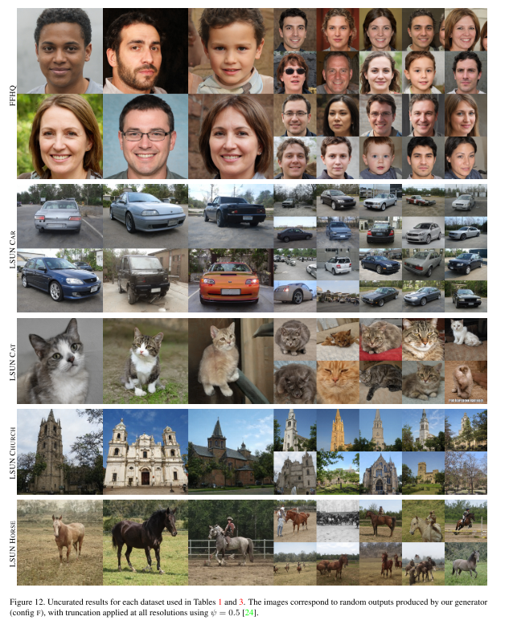

+++
# Date this page was created.
date = 2019-12-30
title = "Analyzing and Improving the Image Quality of StyleGAN"
summary = ""
external_link = "http://arxiv.org/abs/1912.04958"
categories = ["GAN"]
math = true
markup = "goldmark"
+++

## 1. どんなもの？
* StyleGANのver2
* StyleGANの問題の問題を改善
* FIDの向上に加えて，PPL: Perceptual Path Lengthも向上

## 2. 先行研究と比べてどこがすごい？
* StyleGANの問題であった水滴状のノイズ，潜在変数を走査しても顔のパーツが自然に変化しないなどの問題を改善
* Instance Normの見直し，Progressive Growingの見直し，PPLの導入

## 3. 技術や手法の"キモ"はどこ？
### Revisit Instance Norm
* StyleGANでは雨粒状のノイズ (artifact)が現れていた
* 原因はAdaINの演算

* NVIDIAの動画がわかりやすい


* この原因は **Instance Norm** にあり
    * INは各feature mapの平均と分散で正規化
    * 絶対値が小さくてもスパイク状の分布のfeature mapがあるとartifactが出てしまう
    * INを無くせば，artifactが出ないらしい

a. StyleGAN  
b. StyleGANの詳細  
c. INのartifactを考慮した形  
* A(mapping networkの出力$f(z)$)，conv後のstdのみを使うように変更
* B(noise image)のaddはBlockの外に出した

d. (c)のoperationを**weight demodulation**で簡易化  
* AのAdaINではAのstdで割り算していた
* これをfeature mapに対して割り算するのではなく，convのweightに対して割り算することで等価の演算に
* $s$はAをaffineして得られたスケールベクトル，$w \in \mathbb{R} ^{{ch_{in}} \times {ch_{out}} \times {hw}}$はconvのweight
$$
w_{ijk}^{\prime} = s_i \cdot w_{ijk}
$$
$$
w_{ijk}^{\prime\prime} = \frac{w_{ijk}^{\prime}}{\sqrt{\Sigma_{i,k}{{w_{ijk}^{\prime}}^2 + \epsilon}}}
$$
* 入力が標準偏差1のrandom variableであることを仮定している．これは$\sigma$割っていることと同義
$$
\sigma_j = \sqrt{\Sigma_{i,k}{{w_{ijk}^{\prime}}^2}}
$$ 

### Image quality and generator smoothness While
#### Perceptual Path Length
* 潜在空間のPerceptual Path Length: PPLが小さい ⇔ 生成のQuality高い
* PPLを正則化項として追加する
$$
\mathbb{E}_{w,y \sim N(0,\mathbf{I})} \( ||\mathbf{J_w^T y}|| - a\)^2
$$
$$
\mathbf{J_w^T y} = \nabla_w(g(w) \cdot y)
$$

#### Lazy Reguralization
* loss関数は，logistic lossと$R_1$[1]
* $R_1$は毎ミニバッチごとに算出しなくても，16ミニバッチごとくらいでいいよということ
* それがlazy

### Revisiting Progressive Growing
* StyleGANでは，顔のパーツが潜在変数の変化に追従しないという問題あり
    * 画像では，顔の向きが変わっているのに口が変わっていない

* これは，StyleGANのProgressive Growing構造によるもの
    * 各resolutionのGを段階的に学習することで，Gのレイヤは高周波成分を出力するように
    * その結果，GがShift invarianceを失ってしまう

* 代替の構造として以下の(b),(c)を使う
    * Generatorは(b)
    * Discriminatorは(c)

## 4. どうやって有効だと検証した？
* 全工夫の有効性は

* weight demodulationの有効性は以下
    * artifactが消えたのがわかる

* PPLの有効性は以下
    * PPLが小さくなっている

* PGに替わる構造の有効性は以下
    * GとDにskipとresidualを選んだのはこの表から

* 生成は以下

## 5. 議論はあるか？
* PG構造なくしたのはGood．非常に簡潔になった
* AdaINによるartifactへの対処としてのweight modulationも簡潔
* しかし，依然として学習時間はDGX-1で13days

## 6. 次に読むべき論文はある？
1. Lars Mescheder, Andreas Geiger, and Sebastian Nowozin. Which training methods for GANs do actually converge? CoRR, abs/1801.04406, 2018. 5, 10
2. Tero Karras, Samuli Laine, and Timo Aila. A style-based generator architecture for generative adversarial networks. In Proc. CVPR, 2018. 1, 2, 4, 10, 12, 16
3. Animesh Karnewar, Oliver Wang, and Raghu Sesha Iyengar. MSG-GAN: multi-scale gradient GAN for stable image syn- thesis. CoRR, abs/1903.06048, 2019. 6