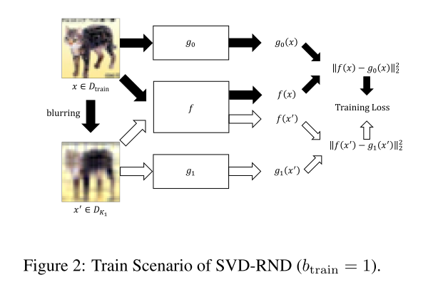
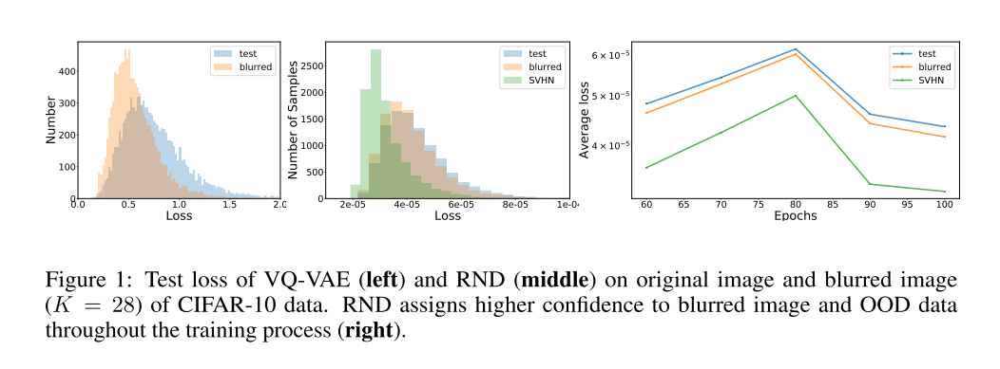
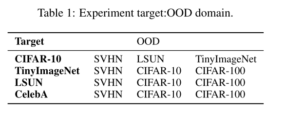
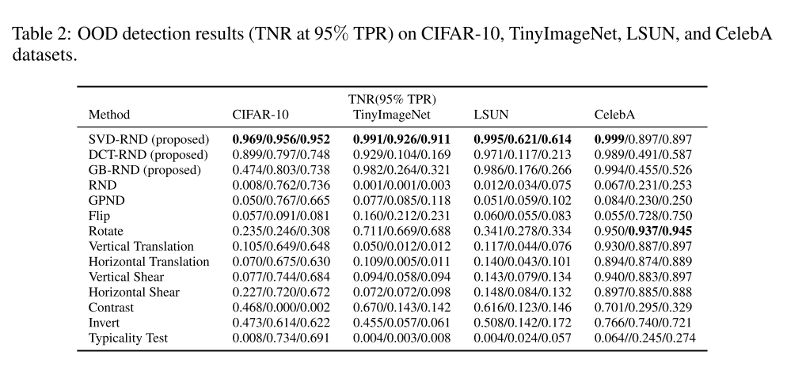
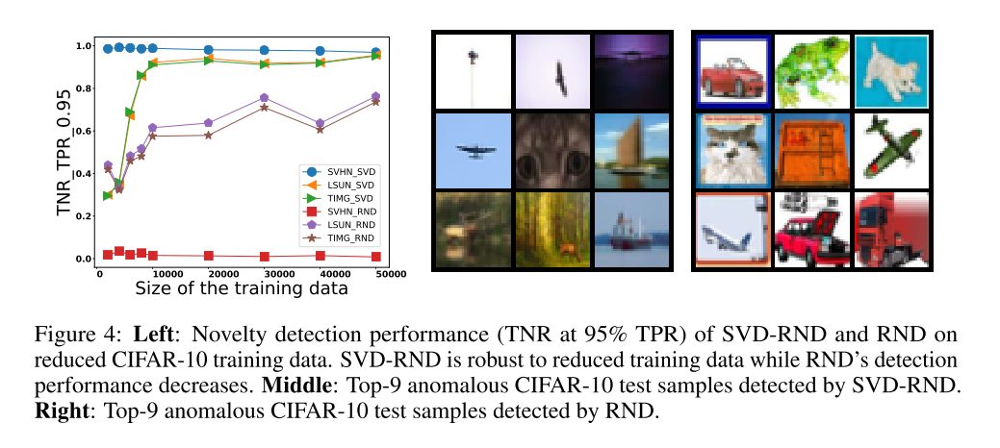

+++
# Date this page was created.
date = 2020-01-21
title = "Novelty Detection Via Blurring"
summary = ""
external_link = "https://openreview.net/forum?id=ByeNra4FDB"
categories = ["Anomaly Detection", "Novelty Detection", "Out of Distribution Detection"]
rate = 4
math = true
markup = "goldmark"
+++

## 1. どんなもの？
* OoD Detectionの枠組み
* 入力をSVD + 特異値0埋めでBlurして，low-rank projectorとなるようなNNを学習
* ↑のようなNNを用いることで，target distribution specificな特徴を抽出

## 2. 先行研究と比べてどこがすごい？
* 従来のOoD Detectionの手法では，OoDなデータに対しても高い尤度を持つことが多々あった
* 幾何変換は使わないので，幾何的な意味を持たないDomainにも適用できそう

## 3. 技術や手法の"キモ"はどこ？
* 入力をSVD + 特異値0埋めでBlur
* low-rank projectorとなるようなNN

### GENERATING BLURRED DATA
* 変数の定義
    * target distribution (training dataset): $D$
    * training data sample: $d \in \mathbb{R}^{H \times W \times i}$
    * $d$の$j$番目のチャネル画像$d_j$のnonzero singular values: $\[ \sigma_{j1}, \sigma_{j2}, \cdots, \sigma_{jN_j} \]$
    * $d_j$のnonzero singular valuesの数: N_j
* $d_j$をSVDすると
$$
d_{j}=\Sigma_{t=1}^{N_{j}} \sigma_{j t} u_{j t} v_{j t}^{T}
$$
* $\[ \sigma_{j1}, \sigma_{j2}, \cdots, \sigma_{jN_j} \]$ のbottom $K$個を0にして，復元するとBlurredなデータが生成される
    * rankが落ちるから

### OOD DETECTION VIA SVD-RND
* 変数の定義
    * Predictor Network: $f$
    * $i$番目のbottom K: $K_i$
    * $i$番目のtarget network: $g_i$ (**random networkで学習時に一切更新されない**)
    * $i$の個数: $b_{train}$
* $b_{train} = 1$のときのモデル構造

* Objective
$$
f^{*}=\arg \min _ {f}\left[\Sigma_{x \in D_{\text {train }}}\left\|f(x)-g_{0}(x)\right\| _ {2}^{2}+\Sigma_{i=1}^{b_{\text {train }}} \Sigma_{x \in D_{K_{i}}}\left\|f(x)-g_{i}(x)\right\|_{2}^{2}\right]
$$
* $f(x)$を$g_i(x)$に近づけることで，$f$がlow-rank projectorになることを期待
* $f$がtarget distribution specificな特徴を獲得する
* 推論時にはscoreとして下を用いる
$$
\left\|f(x)-g_{0}(x)\right\|_2^2
$$
* VQ-VAEやRNDではtarget distribution specificな特徴を獲得できていないため，blurred dataでも高い尤度を持つ

## 4. どうやって有効だと検証した？
* Cifar-10, TinyImageNet, LSUN, CelebAで実験
* Cifar-10がtargetなら，他はOoDといったようにして実験

* $fpr@tpr=0.95$で評価 (異常検知でいうところの5%見逃し許容したときの過検出率)

* SVD-RNDは学習枚数が少なくても精度が優秀

## 5. 議論はあるか？
* 5章で更に検証してるけど，詳細は気が向いたら
* $K_1=28$とかは記述あるけど，$K_2$は29とかでいいんだろうか？
* ICLR2020 accept

## 6. 次に読むべき論文はある？
1. Burda, Y., Edwards, H., Storkey, A., & Klimov, O. (2018). Exploration by Random Network Distillation. Retrieved from https://arxiv.org/abs/1810.12894